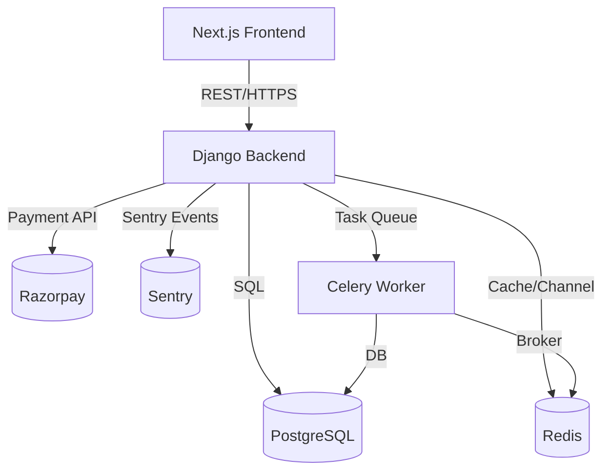
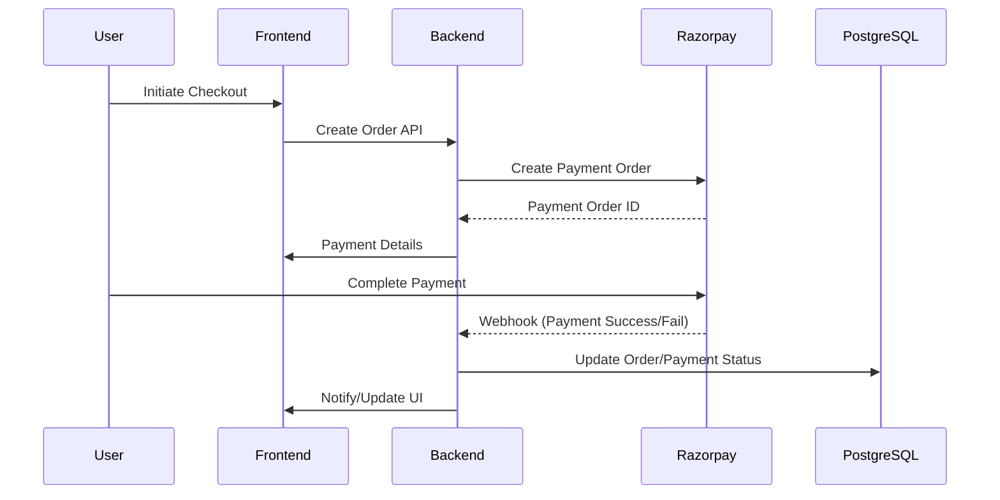
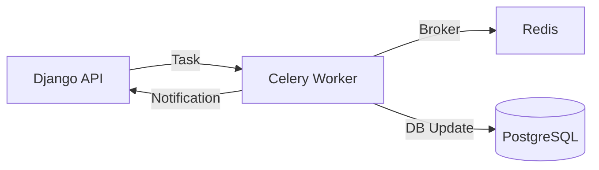

# PROJECT_STRUCTURE.md

## Venopai Ecommerce Platform
**Repository Structure & Architecture Documentation**

---

### Table of Contents
1. Repository Tree
2. Folder Explanations
3. Backend Architecture
4. Frontend Architecture
5. Infrastructure & Deployment
6. Operational Documentation
7. Redis & Celery Integration
8. Payment & Inventory Modules
9. Testing & Load Testing
10. Architecture Diagrams (Mermaid)
11. Onboarding Guidance

---

## Repository Tree

```
.
├── docker-compose.yml
├── docker-compose.dev.yml
├── docker-compose.prod.yml
├── Backend/
│   ├── .env.example
│   ├── .env.local
│   ├── .env.production.example
│   ├── Dockerfile
│   ├── Dockerfile.prod
│   ├── manage.py
│   ├── requirements.txt
│   ├── adminpanel/
│   ├── apps/
│   ├── core/
│   ├── orders/
│   ├── payments/
│   ├── products/
│   ├── users/
│   └── vendors/
├── Frontend/
│   ├── .env.example
│   ├── .env.local
│   ├── .env.production.example
│   ├── Dockerfile
│   ├── Dockerfile.prod
│   ├── middleware.ts
│   ├── next.config.mjs
│   ├── package.json
│   ├── tailwind.config.ts
│   ├── tsconfig.json
│   ├── app/
│   ├── components/
│   ├── lib/
│   └── public/
├── docs/
│   ├── README.md
│   ├── architecture/
│   ├── deployment/
│   ├── operations/
│   ├── security/
│   ├── testing/
│   ├── product/
│   ├── onboarding/
│   ├── reference/
│   └── archive/
├── load_tests/
│   ├── k6_auth_refresh.js
│   ├── k6_checkout.js
│   ├── k6_inventory_contention.js
│   ├── k6_webhook_burst.js
│   └── locustfile.py
├── scripts/
│   └── smoke_test.py
├── PROJECT_STRUCTURE.md
├── REPOSITORY_CLEANUP_REPORT.md
```

---

## Folder Explanations

- **Backend/**: Django backend project, modularized by business domains (orders, payments, products, users, vendors, adminpanel, etc.).
- **Frontend/**: Next.js frontend application, with reusable components, app routes, and static assets.
- **docs/**: Canonical documentation organized by architecture, operations, deployment, security, testing, product, onboarding, and reference.
- **load_tests/**: Load and stress testing scripts using k6 and Locust.
- **scripts/**: Utility scripts for smoke testing and automation.
- **docker-compose*.yml**: Service orchestration for local, dev, and production environments.
- **PROJECT_STRUCTURE.md**: Repository map and architecture overview.

---

## Backend Architecture

- **Framework**: Django, organized by domain (orders, payments, products, users, vendors).
- **Core**: Centralized settings, API routing, Celery config, and shared utilities.
- **Adminpanel**: Admin dashboards and operational endpoints.
- **Apps**: Modular business logic (chatbot, price_watch, recommendations, wishlist).
- **Orders**: Transactional order management, inventory reservation, and checkout flows.
- **Payments**: Razorpay integration, payment lifecycle, webhook handling, idempotency.
- **Users**: JWT authentication, user profiles, and permissions.
- **Celery**: Asynchronous task processing for order fulfillment, notifications, and background jobs.
- **Redis**: Used for caching, Celery broker, and Django channel layer.

---

## Frontend Architecture

- **Framework**: Next.js (React), supporting SSR/SSG.
- **app/**: Application routes and pages.
- **components/**: Reusable UI components.
- **lib/**: Client-side utilities and API clients.
- **public/**: Static assets (images, icons).
- **middleware.ts**: Middleware for authentication and routing.
- **Environment**: `.env.example` + `.env.local` for local config, `.env.production.example` for production.

---

## Infrastructure & Deployment

- **Docker Compose**: Orchestrates backend, frontend, PostgreSQL, Redis, and Celery services.
- **Dockerfiles**: Separate for backend and frontend, with production variants.
- **Environment Files**: `.env.example` and `.env.local` per service, production templates per service.
- **PostgreSQL**: Primary database, managed via Docker Compose.
- **Redis**: Caching and async broker, managed via Docker Compose.
- **CI/CD Ready**: Structure supports GitHub Actions or similar pipelines.

---

## Operational Documentation

- **operations/**: Runbooks, incident response, observability, readiness audits.
- **deployment/**: Deployment architecture and release runbooks.
- **security/**: Security controls, compliance, and hardening checklists.
- **testing/**: Test strategy, staging validation, and load testing guidance.

---

## Redis & Celery Integration

- **Redis**: Acts as the broker for Celery, Django cache, and channel layer for async events.
- **Celery**: Handles background jobs (order processing, notifications, etc.), configured in `Backend/core/celery.py`.
- **Integration**: Celery workers and scheduler are orchestrated via Docker Compose, communicating with Redis and the Django backend.

---

## Payment & Inventory Modules

- **Payments**: `Backend/payments/` handles Razorpay integration, payment order creation, webhook processing, and idempotency.
- **Inventory**: `Backend/orders/` manages inventory reservation, transactional safety, and order fulfillment.
- **Relationship**: Payment success triggers inventory reservation and order status updates, ensuring consistency.

---

## Testing & Load Testing

- **Backend Tests**: Each Django app contains its own `tests.py` for unit and integration tests.
- **Frontend Tests**: (Not shown, but typically in `Frontend/` as `__tests__` or similar).
- **Load Tests**: `load_tests/` contains k6 and Locust scripts for simulating high-traffic scenarios and validating system resilience.
- **Smoke Tests**: `scripts/smoke_test.py` for automated end-to-end validation of critical flows.

---

## Architecture Diagrams (Mermaid)

### High-Level System Architecture



### Payment & Inventory Workflow



### Async Processing Flow



---

## Onboarding Guidance

- **Start Here**: Read `docs/onboarding/ENGINEERING_ONBOARDING.md` and `docs/onboarding/ENVIRONMENT_SETUP.md`.
- **Local Development**: Use Docker Compose and `.env.local` files for setup.
- **Backend**: Review `Backend/core/` for settings, `orders/` and `payments/` for business logic.
- **Frontend**: Explore `Frontend/app/` and `components/` for UI and routing.
- **Testing**: Run smoke and load tests from `scripts/` and `load_tests/`.
- **Operations**: Study operational docs in `docs/operations/` and `docs/deployment/`.
- **Security**: Follow best practices in `docs/security/` and use example env files for secrets management.
- **Async/Observability**: Understand Celery/Redis setup and Sentry integration for monitoring.

---

This document provides a concise, accurate, and production-ready overview of the Venopai repository structure and architecture. For deeper dives, refer to the operational documentation and code comments within each module.
