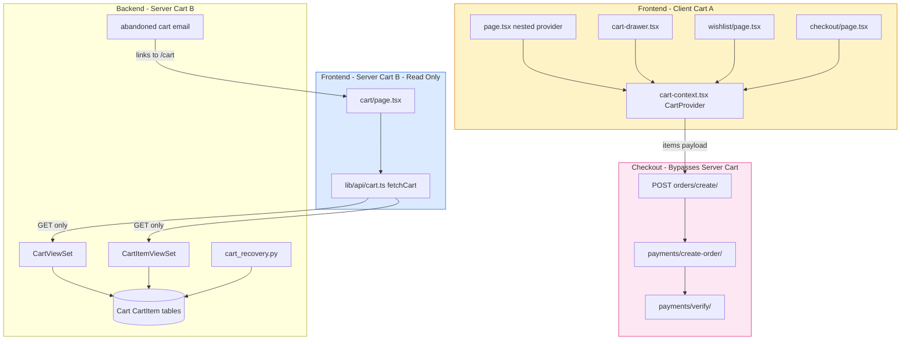
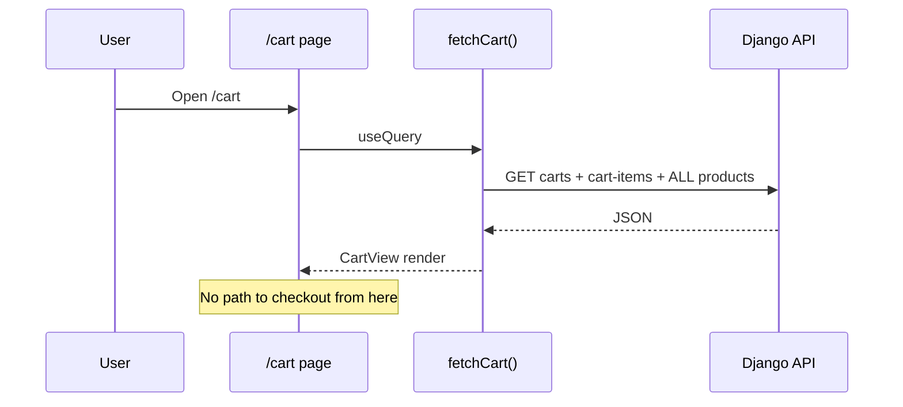
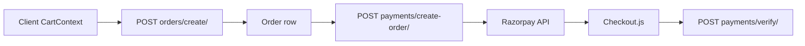
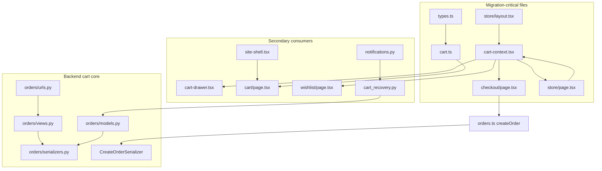
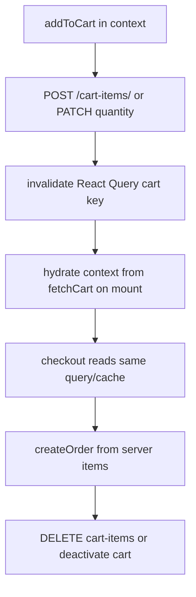
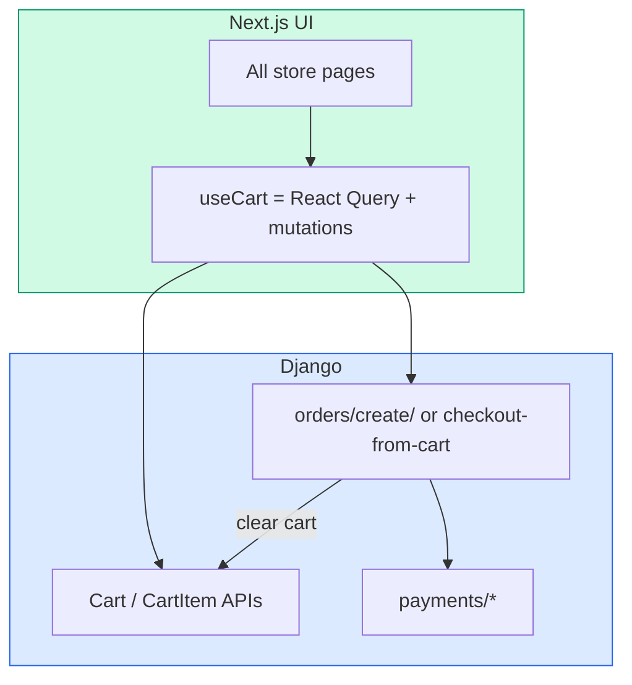

# Cart Architecture — Complete Analysis

**Project:** Venopai  
**Date:** May 16, 2026  
**Scope:** All cart-related frontend, backend, flows, and migration planning

---

## Executive summary

This project implements **two independent cart systems** that are **not synchronized**:

| System | Storage | Used by checkout? | Persists across sessions? |
|--------|---------|-------------------|---------------------------|
| **A — Client cart** | React Context (`CartProvider`) | **Yes** | No (in-memory; lost on refresh) |
| **B — Server cart** | PostgreSQL `Cart` + `CartItem` | **No** | Yes (per authenticated user) |

**Critical finding:** `Frontend/app/(store)/page.tsx` wraps content in a **nested** `CartProvider`, so items added on the home page live in an **inner** context that is **discarded** on navigation. Checkout uses the **outer** provider from `layout.tsx`, which is typically **empty** after shopping on `/`.

**Order creation** (`POST /api/v1/orders/create/`) does **not** read or clear the server cart. It only accepts a raw `{ items: [{ product_id, quantity }] }` payload—the same shape the client cart builds at checkout time.

---

## 1. Architecture overview



---

## 2. All frontend cart logic

### 2.1 Core state: `CartProvider` (client cart A)

**File:** `Frontend/components/providers/cart-context.tsx`

| Export | Purpose |
|--------|---------|
| `CartProduct` | `{ id, name, price }` — `price` is **string** (often formatted `₹7,499`) |
| `CartItem` | `CartProduct` + `cartItemId: string` (UUID or fallback id) |
| `CartProvider` | Holds `cartItems[]` in `useState` |
| `useCart()` | Hook; throws if outside provider |

**Behavior:**

- `addToCart(product)` — **appends a new line** every time (does not merge quantity per `product.id`)
- `removeFromCart(cartItemId)` — removes **one line** by client id
- `totalItems` — `cartItems.length` (line count, not sum of quantities)
- `totalPrice` — sums `parsePrice(item.price)` per line
- `parsePrice` — strips non-numeric chars; fragile on malformed strings

**No APIs called.** No persistence. No auth check inside context.

### 2.2 Server cart API module (read-only)

**File:** `Frontend/lib/api/cart.ts`

| Export | Purpose |
|--------|---------|
| `CartItemWithProduct` | API `CartItem` + optional `product_details` |
| `CartView` | `{ cart, items }` |
| `fetchCart()` | **Read-only** aggregation |

**`fetchCart()` algorithm:**

1. `GET /api/v1/orders/carts/`
2. `GET /api/v1/orders/cart-items/`
3. `GET /api/v1/products/` — **entire catalog** to join product details
4. Pick first `is_active === true` cart
5. Filter cart-items by `cart.id`, attach `product_details` from Map

**Missing functions (never implemented):**

- `addCartItem`, `updateCartItem`, `removeCartItem`
- `ensureActiveCart`, `clearCart`

### 2.3 Page-level logic

| File | Cart logic |
|------|------------|
| `Frontend/app/(store)/page.tsx` | Hardcoded `featuredProducts`; `addToCart`; **nested `CartProvider`**; `CartDrawer` |
| `Frontend/app/(store)/checkout/page.tsx` | Reads `useCart()`; aggregates lines to `{ product_id, quantity }`; `createOrder` → Razorpay |
| `Frontend/app/(store)/cart/page.tsx` | `useQuery` + `fetchCart()` only; **no mutations**, no link to checkout |
| `Frontend/app/(store)/wishlist/page.tsx` | `addToCart` from API wishlist data; removes wishlist item after move |
| `Frontend/app/(store)/products/page.tsx` | **No cart integration** |
| `Frontend/app/(store)/products/[slug]/page.tsx` | Wishlist only; **no add-to-cart** |

### 2.4 Type definitions (API)

**File:** `Frontend/lib/api/types.ts`

```typescript
// Server cart (API)
export type CartItem = { id, cart, product, quantity, created_at, updated_at };
export type Cart = { id, user, is_active, created_at, updated_at };
```

**Name collision:** `CartItem` in `cart-context.tsx` is a **different type** than `CartItem` in `types.ts`.

---

## 3. All backend cart APIs

### 3.1 URL routing

**File:** `Backend/orders/urls.py`

| Route | ViewSet | Basename |
|-------|---------|----------|
| `/api/v1/orders/carts/` | `CartViewSet` | `cart` |
| `/api/v1/orders/cart-items/` | `CartItemViewSet` | `cart-item` |

Registered under `Backend/core/api_urls.py` → `path("orders/", include("orders.urls"))`.

### 3.2 `CartViewSet`

**File:** `Backend/orders/views.py` (lines 37–45)

| Method | Endpoint | Behavior |
|--------|----------|----------|
| GET | `/api/v1/orders/carts/` | List user's carts (`prefetch_related("items")`) |
| POST | `/api/v1/orders/carts/` | Create cart; `user` set in `perform_create` |
| GET | `/api/v1/orders/carts/{id}/` | Retrieve |
| PUT/PATCH/DELETE | `/api/v1/orders/carts/{id}/` | Standard ModelViewSet |

**Permission:** `IsAuthenticated`  
**No custom actions** (no `merge`, `checkout`, `clear`).

### 3.3 `CartItemViewSet`

**File:** `Backend/orders/views.py` (lines 48–53)

| Method | Endpoint | Behavior |
|--------|----------|----------|
| GET | `/api/v1/orders/cart-items/` | All items for user's carts |
| POST | `/api/v1/orders/cart-items/` | Add item; validates cart ownership |
| GET/PATCH/DELETE | `/api/v1/orders/cart-items/{id}/` | Standard CRUD |

**Permission:** `IsAuthenticated`

### 3.4 Serializers

**File:** `Backend/orders/serializers.py`

| Serializer | Fields | Notes |
|------------|--------|-------|
| `CartSerializer` | `id, user, is_active, created_at, updated_at` | `user` read-only on create |
| `CartItemSerializer` | `id, cart, product, quantity, ...` | `validate_cart` ensures cart belongs to user |

### 3.5 Order creation (related but not cart conversion)

**Endpoint:** `POST /api/v1/orders/create/`  
**File:** `Backend/orders/views.py` → `OrderViewSet.create_order`  
**Serializer:** `CreateOrderSerializer`

- Accepts `{ items: [{ product_id, quantity }] }`
- Creates `Order` + `OrderItem` rows from **live product prices**
- Does **not** read `Cart` / `CartItem`
- Does **not** set `is_active=False` on cart
- Does **not** delete cart items

### 3.6 Abandoned cart (backend-only lifecycle)

| File | Role |
|------|------|
| `Backend/orders/cart_recovery.py` | Query stale active carts with items; send email |
| `Backend/orders/management/commands/send_abandoned_cart_reminders.py` | CLI entry |
| `Backend/orders/notifications.py` | `send_abandoned_cart_email`; link `FRONTEND_APP_URL/cart` |
| `Backend/orders/signals.py` | Updates `Cart.updated_at` when cart items change |

**Threshold:** 2 hours inactivity (`ABANDONED_CART_INACTIVITY_HOURS`).

### 3.7 Database model

**File:** `Backend/orders/models.py`

```text
Cart
  - user FK
  - is_active (indexed)
  - abandoned_cart_reminder_sent_at
  - UNIQUE: one active cart per user (DB constraint)

CartItem
  - cart FK, product FK
  - quantity (default 1)
  - UNIQUE: (cart, product) — one row per product, quantity on row
```

**Semantic difference from client cart:** Server merges products into one row; client creates **multiple rows** per product.

---

## 4. Cart-related components

| File | Role | Cart system |
|------|------|-------------|
| `Frontend/components/providers/cart-context.tsx` | State provider + hook | **A — Client** |
| `Frontend/components/layout/cart-drawer.tsx` | Slide-over UI; remove lines; **Checkout disabled** | **A — Client** |
| `Frontend/components/layout/site-shell.tsx` | Nav link `href="/cart"` | Routes to **B display** |
| `Frontend/components/wishlist/wishlist-card.tsx` | "Move to cart" button UI | Delegates to parent |
| `Frontend/app/(store)/layout.tsx` | Wraps store in `CartProvider` | **A — outer** |
| `Frontend/app/(store)/page.tsx` | Product cards + **inner** `CartProvider` | **A — inner island** |

**No dedicated:** `CartLineItem.tsx`, `CartSummary.tsx`, `QuantityStepper.tsx` for server cart.

---

## 5. Contexts / stores / hooks

| Name | Location | Type | Cart system |
|------|----------|------|-------------|
| `CartProvider` | `cart-context.tsx` | React Context | A |
| `useCart` | `cart-context.tsx` | Hook | A |
| `useAuthStore` | `lib/stores/auth-store.ts` | Zustand | Auth only (no cart) |
| `useQuery(['cart'])` | `cart/page.tsx` | React Query | B (read) |

**There is no** `useServerCart`, `useCartStore` (Zustand), or shared cart hook.

---

## 6. Page classification

### 6.1 Local cart only (system A)

| Route | File | Notes |
|-------|------|-------|
| `/` | `app/(store)/page.tsx` | Nested provider; mock product IDs |
| `/checkout` | `app/(store)/checkout/page.tsx` | **Payment path** |
| `/wishlist` | `app/(store)/wishlist/page.tsx` | Uses **outer** layout provider |

### 6.2 Server cart only (system B)

| Route | File | Notes |
|-------|------|-------|
| `/cart` | `app/(store)/cart/page.tsx` | Read-only list; no checkout CTA |

### 6.3 Mixed / broken cross-over

| Route | Behavior |
|-------|----------|
| `/` → `/checkout` | **Broken:** inner cart discarded; outer cart empty |
| `/wishlist` → `/checkout` | **May work:** same outer provider |
| `/cart` → `/checkout` | **Broken:** server cart ignored at checkout |
| `/products` → `/checkout` | **No add-to-cart** on listing/detail |

### 6.4 No cart usage

`/login`, `/register`, `/account/orders/*`, `/order-success`, `/referral`, `/admin/*`, `/dashboard`, `/products`, `/products/[slug]` (no cart button).

---

## 7. Current cart data flows

### 7.1 Client cart (add → checkout)

```mermaid
sequenceDiagram
    participant U as User
    participant P as Page / Drawer
    participant CTX as CartProvider
    participant API as Django API
    participant RZP as Razorpay

    U->>P: Add to cart
    P->>CTX: addToCart({id,name,price})
    Note over CTX: New line per click; no server write

    U->>P: Checkout
    P->>CTX: read cartItems
    CTX-->>P: lines with string prices
    P->>P: Map product_id → quantity count
    P->>API: POST /orders/create/ {items}
    API-->>P: Order id + total_amount
    P->>API: POST /payments/create-order/
    API->>RZP: create order
    P->>RZP: Checkout modal
    P->>API: POST /payments/verify/
```

### 7.2 Server cart (view only)



### 7.3 Abandoned cart email (server only)

```mermaid
flowchart LR
    CRON[cron / management command] --> REC[send_abandoned_cart_reminders]
    REC --> DB[(Cart is_active + items)]
    REC --> MAIL[SMTP email]
    MAIL --> LINK[FRONTEND_APP_URL/cart]
    LINK --> CART_PAGE[/cart page - server cart]
```

---

## 8. Checkout flow dependency on cart

| Step | Depends on | Detail |
|------|------------|--------|
| Empty check | `cartItems.length` from **client** context | Server cart ignored |
| Line aggregation | Client lines → `Map<product_id, quantity>` | Each **line** = qty 1 even if UI showed one product twice |
| Pricing display | `totalPrice` from **parsed string prices** | May **differ** from server `Order.total_amount` (DB product.price) |
| `createOrder` | `{ product_id, quantity }[]` | No `cart_id`; no stock pre-check on FE |
| Razorpay amount | From **payment API** using order id | Uses server order total, not client `totalPrice` |
| Post-success | Redirect `/order-success` | Client cart **not cleared** in code |

**Price mismatch bug risk:** Checkout UI total uses client-formatted strings; Razorpay charges **server-computed** order total.

---

## 9. Wishlist dependency on cart

**File:** `Frontend/app/(store)/wishlist/page.tsx`

```text
fetchWishlist (API) → user clicks "Move to cart"
  → addToCart (client context, outer provider)
  → removeFromWishlist (API)
```

| Aspect | Behavior |
|--------|----------|
| Wishlist storage | Server (`/api/v1/wishlist/`) |
| Move to cart | **Client only** — no `POST cart-items` |
| Price passed | `product_details.price` or `"0"` fallback |
| After move | Wishlist item removed; cart not visible on `/cart` page |

---

## 10. Razorpay dependency on cart

Razorpay does **not** integrate with either cart system directly.



| Input to Razorpay | Source |
|-------------------|--------|
| `order_id` | `createOrder` response |
| `amount` | Backend from `Order.total_amount` |
| `idempotency_key` | Client: `checkout-${order.id}` |

**Cart irrelevant** after `createOrder` payload is built.

---

## 11. Middleware / auth dependency on cart

**File:** `Frontend/middleware.ts`

```typescript
matcher: ["/cart/:path*", "/checkout/:path*", "/referral/:path*", "/admin/:path*", "/dashboard/:path*"]
```

| Route | Middleware | API cart needs auth? |
|-------|------------|----------------------|
| `/cart` | Requires `access_token` cookie | Yes — `fetchCart` uses JWT via `apiClient` |
| `/checkout` | Requires cookie | Yes — `createOrder` requires auth |
| `/` (add to cart) | **Not protected** | Client cart works logged out until checkout |
| `/wishlist` | Not in matcher | Client add works; wishlist API needs token |

**Gap:** User can fill client cart on `/` without login; `/checkout` middleware redirects to login — **client cart may reset** on return (new session / outer empty provider).

**Cookie sync:** `auth-store` sets `access_token` cookie from localStorage on `initialize()` — middleware and axios must stay in sync.

---

## 12. Dependency graph (files)



---

## 13. Most important files for cart migration

### Tier 1 — Must change

| Priority | File | Why |
|----------|------|-----|
| 1 | `Frontend/components/providers/cart-context.tsx` | Replace or bridge to server cart |
| 2 | `Frontend/lib/api/cart.ts` | Add mutations; stop fetching all products |
| 3 | `Frontend/app/(store)/checkout/page.tsx` | Source items from server; clear cart after pay |
| 4 | `Frontend/app/(store)/page.tsx` | Remove nested provider; real product IDs |
| 5 | `Backend/orders/serializers.py` | Optional: `checkout_from_cart` or clear cart in `CreateOrderSerializer` |

### Tier 2 — Should change

| File | Why |
|------|-----|
| `Frontend/app/(store)/cart/page.tsx` | Mutations, checkout CTA, React Query invalidation |
| `Frontend/app/(store)/wishlist/page.tsx` | `POST cart-items` instead of `addToCart` |
| `Frontend/components/layout/cart-drawer.tsx` | Enable checkout link; server sync |
| `Frontend/app/(store)/products/[slug]/page.tsx` | Add to cart button |
| `Backend/orders/views.py` | Optional dedicated checkout-from-cart action |

### Tier 3 — Align / cleanup

| File | Why |
|------|-----|
| `Frontend/lib/api/types.ts` | Rename types to avoid `CartItem` collision |
| `Frontend/app/(store)/layout.tsx` | Single provider pattern |
| `Backend/orders/cart_recovery.py` | Still valid once server cart is canonical |
| `API_CONTRACT.md` | Document checkout-from-cart behavior |

---

## 14. Dead code, duplication, inconsistencies

### 14.1 Dead / ineffective code

| Item | Location | Issue |
|------|----------|-------|
| Server cart mutations (FE) | `cart.ts` | No `POST/PATCH/DELETE` wrappers — **half-dead API client** |
| Cart drawer checkout | `cart-drawer.tsx:65-67` | `<Button disabled>Checkout</Button>` — **dead CTA** |
| Inner `CartProvider` on `/` | `page.tsx:158-160` | Isolates state — **effectively breaks home → checkout** |
| `fetchCart` on empty server cart | `cart/page.tsx` | Shows empty with no "continue shopping" or add flow |

### 14.2 Duplicate logic

| Duplication | Locations |
|-------------|-----------|
| Price parsing | `cart-context.tsx` `parsePrice`; `checkout/page.tsx` `replace(/[^0-9.]/g, "")` |
| Quantity aggregation | `checkout/page.tsx` (Map by product_id); could match server `CartItem.quantity` model |
| `CartProvider` | `layout.tsx` + `page.tsx` — **double wrap** |
| INR formatting | `cart-drawer.tsx`, `checkout/page.tsx` — separate `Intl.NumberFormat` instances |

### 14.3 Inconsistent types / interfaces

| Name | Client (`cart-context`) | API (`types.ts`) |
|------|-------------------------|------------------|
| `CartItem` | `{ id, name, price, cartItemId }` | `{ id, cart, product, quantity, ... }` |
| Product id | `id` on line | `product` FK |
| Quantity | Implicit 1 per line | Explicit `quantity` |
| Price | Display string | From `Product.price` decimal string |

### 14.4 API mismatches

| Client assumption | Server reality |
|-------------------|----------------|
| Multiple lines per product | **One** `CartItem` per `(cart, product)` |
| Checkout uses cart | `CreateOrderSerializer` **ignores** cart |
| `/cart` shows what you checkout | Checkout uses **different** store |
| Home product `id: 1..4` | May not exist in DB → order create **400** |
| Client `totalPrice` | Razorpay uses **server** order total |

---

## 15. Possible bugs (ranked)

| # | Severity | Bug | Reproduction |
|---|----------|-----|--------------|
| 1 | **Critical** | Nested `CartProvider` on `/` — checkout uses empty outer cart | Add on home → go to `/checkout` → empty |
| 2 | **Critical** | `/cart` server cart ≠ checkout client cart | Add via API/tests → checkout shows different items |
| 3 | **High** | Home mock IDs 1–4 may not exist | Add featured product → checkout → `createOrder` fails |
| 4 | **High** | Client display total ≠ charged amount | Format prices differently from DB decimals |
| 5 | **Medium** | Client cart not cleared after payment | Success page → return checkout → old lines may remain |
| 6 | **Medium** | `totalItems` counts lines not units | 3 clicks same product → shows 3 items, correct qty at checkout but confusing UX |
| 7 | **Medium** | `fetchCart` downloads **all products** | Large catalog → slow `/cart` |
| 8 | **Low** | Abandoned email links to `/cart` not `/checkout` | User must re-assemble intent |
| 9 | **Low** | Logged-out users build cart then hit auth wall | Cart lost on login if outer provider empty |

---

## 16. Migration risks

| Risk | Impact | Mitigation |
|------|--------|------------|
| Breaking checkout during swap | Revenue stop | Feature flag; dual-write period |
| Nested provider removal | Home behavior change | Single provider + integration test |
| Price display vs server | User trust | Always show totals from API preview endpoint |
| Active cart constraint | 400 on duplicate active cart | `getOrCreateActiveCart()` helper |
| Abandoned cart emails | Wrong empty cart | Only email server cart; delay until migration complete |
| Existing users with orphan server carts | Data clutter | One-time merge or clear script |
| Stock races | Oversell | Keep stock check on `createOrder` (already server-side) |

---

## 17. Recommended migration strategy

### Phase 0 — Stop the bleeding (1 day)

1. **Remove nested `CartProvider`** from `Frontend/app/(store)/page.tsx` — use layout provider only.
2. **Enable** checkout link in `cart-drawer.tsx` → `/checkout`.
3. Replace home `featuredProducts` with API products or link to `/products`.

### Phase 1 — Server cart as source of truth (3–5 days)



**Implement in `lib/api/cart.ts`:**

- `ensureActiveCart(): Promise<Cart>` — GET carts; if none POST carts
- `addToCart(productId, qty)` — POST cart-items; on 400 unique constraint → PATCH quantity
- `updateCartItem(id, qty)` / `removeCartItem(id)`
- `getCartView()` — replace naive full-catalog fetch with `?product=` or nested serializer (backend enhancement)

**Refactor `cart-context.tsx`:**

- Option A: Thin wrapper over React Query (`useCart` = query + mutations)
- Option B: Keep context as view model synced from query `onSuccess`

### Phase 2 — Checkout alignment (2 days)

1. Checkout uses `useQuery(['cart'])` or shared context hydrated from server.
2. Add `GET /api/v1/orders/preview/` (optional) returning priced lines before `createOrder`.
3. After `verifyRazorpayPayment` success → `clearCart()` + invalidate queries.
4. Wire `products/[slug]` add-to-cart to same mutation.

### Phase 3 — Backend cart lifecycle (2 days)

1. Extend `CreateOrderSerializer.create()` to optionally accept `from_cart: true`:
   - Build items from active `CartItem`s
   - Set `cart.is_active = False` after order created
2. Or add `POST /api/v1/orders/checkout-from-cart/`.
3. Keep abandoned-cart recovery on server cart (already correct).

### Phase 4 — Cleanup

1. Delete duplicate `parsePrice` — single `formatINR` / `parseINR` util.
2. Rename client types → `LocalCartLine` or remove entirely.
3. Add E2E: add → `/cart` → `/checkout` → pay (test mode).
4. Add product page + wishlist integration tests.

---

## 18. Target end-state architecture



---

## 19. File inventory (complete)

### Frontend

| Path | Role |
|------|------|
| `Frontend/components/providers/cart-context.tsx` | Client cart state |
| `Frontend/lib/api/cart.ts` | Server cart read |
| `Frontend/lib/api/types.ts` | `Cart`, `CartItem` API types |
| `Frontend/lib/api/orders.ts` | `createOrder` |
| `Frontend/lib/api/payments.ts` | Razorpay after order |
| `Frontend/lib/api/client.ts` | JWT axios |
| `Frontend/components/layout/cart-drawer.tsx` | Drawer UI |
| `Frontend/components/layout/site-shell.tsx` | Nav to `/cart` |
| `Frontend/components/wishlist/wishlist-card.tsx` | Move to cart UI |
| `Frontend/app/(store)/layout.tsx` | Outer `CartProvider` |
| `Frontend/app/(store)/page.tsx` | Home + inner provider |
| `Frontend/app/(store)/cart/page.tsx` | Server cart page |
| `Frontend/app/(store)/checkout/page.tsx` | Client cart checkout |
| `Frontend/app/(store)/wishlist/page.tsx` | Move to client cart |
| `Frontend/middleware.ts` | Auth gate for cart/checkout |

### Backend

| Path | Role |
|------|------|
| `Backend/orders/models.py` | `Cart`, `CartItem` |
| `Backend/orders/views.py` | `CartViewSet`, `CartItemViewSet` |
| `Backend/orders/serializers.py` | Cart + `CreateOrderSerializer` |
| `Backend/orders/urls.py` | Router registration |
| `Backend/orders/signals.py` | Cart `updated_at` on item change |
| `Backend/orders/cart_recovery.py` | Abandoned cart query |
| `Backend/orders/notifications.py` | Abandoned email |
| `Backend/orders/management/commands/send_abandoned_cart_reminders.py` | Cron command |
| `Backend/orders/admin.py` | Django admin for carts |
| `Backend/orders/tests.py` | Cart security + abandoned tests |
| `Backend/core/api_urls.py` | Mount orders routes |
| `API_CONTRACT.md` | Cart endpoint documentation |

---

## 20. Quick reference matrix

| Question | Answer |
|----------|--------|
| What does checkout use? | **Client** `CartContext` only |
| What does `/cart` show? | **Server** cart via `fetchCart` |
| Are they synced? | **No** |
| Does order create use server cart? | **No** |
| Does Razorpay see the cart? | **No** — only `Order` |
| Is there a Zustand cart? | **No** |
| Can guest checkout? | **No** — middleware + API auth |
| Biggest bug? | **Nested CartProvider on home** |

---

*End of Cart Architecture Analysis*
