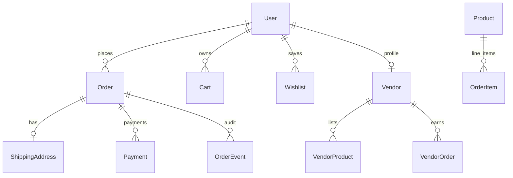

# PROJECT RECOVERY REPORT

**Repository:** `venopai` (workspace: `c:\workflow\venopai`)  
**Analysis date:** May 16, 2026  
**Method:** Full static review of source, configs, migrations, docs, CI, and Docker; cross-referenced with existing audits (`docs/AUDIT_REPORT.md`, `docs/IMPLEMENTATION_AUDIT_REPORT.md`, `docs/PRODUCTION_READINESS_AUDIT.md`, `docs/ROADMAP.md`).

---

# 1. Project Overview

## Purpose of the ecommerce platform

**Venopai** is positioned (in `docs/VENOPAI_PRD.md`, `docs/VENOPAI_PRODUCT_BLUEPRINT.md`, `docs/VENOPAI_COPILOT_CONTEXT.md`) as a **student-focused engineering commerce platform** with ambitions toward **custom manufacturing**, referrals, refurbished hardware, and India-centric payments (INR, Razorpay).

The **implemented codebase** is primarily a **B2C ecommerce monolith**: catalog, cart/orders, Razorpay payments, admin order ops, wishlist, reviews, referrals, vendor APIs, price-watch alerts, and an OpenAI-backed chatbot. **Custom manufacturing** (upload design → quote → production pipeline) exists only in documentation—not in Django apps or Next.js routes.

## Overall project idea

| Layer | Vision (docs) | Reality (code) |
|-------|---------------|----------------|
| Storefront | Next.js + polished UX | Partially built; home page still uses **hardcoded demo products** |
| Backend | Django REST `/api/v1/` | Mature: orders, payments, products, admin APIs |
| Manufacturing | State machine + Kanban | **Not implemented** |
| Media | Cloudinary direct upload | **URL-only** `ProductImage.image_url`; no Cloudinary SDK |
| Multi-vendor | Marketplace | **Backend only** (`vendors/`); **no vendor frontend** |

## Current development status

Development did **not stop at greenfield**. Recent git history shows active **production-hardening** work:

- PR #28: Redis caching for product/analytics reads + Celery Redis infra (`health_check_task`)
- PR #27: Scoped API throttling (auth, register, orders, payments, chatbot, wishlist, price-watch)
- PR #26: Full technical audit, logging audit, production readiness fixes
- Earlier: CI/CD, Docker, health endpoint, payment service extraction, OpenAPI (`drf-spectacular`)

**Likely pause point:** After **backend completeness + audits/infra**, before **frontend–backend integration polish** (unified cart, registration UI, manufacturing, vendor portal, tracking WebSocket on client).

## Estimated completion percentage

| Area | Weight | Estimate |
|------|--------|----------|
| Backend core ecommerce | 35% | **~90%** |
| Frontend customer flows | 30% | **~55%** |
| Admin/custom ops UI | 15% | **~65%** |
| Planned vertical features (manufacturing, Cloudinary, vendor UI) | 15% | **~5%** |
| Production ops (observability, S3, Celery tasks, E2E tests) | 5% | **~50%** |

**Overall estimated completion: ~72–78%** for a **deployable student ecommerce MVP**; **~45–50%** relative to the **full Venopai blueprint** (manufacturing + marketplace + Cloudinary + advanced AI).

---

# 2. Tech Stack

## Frontend technologies

| Technology | Version / usage | Files |
|------------|-----------------|-------|
| **Next.js** | 14.2.x, App Router | `Frontend/app/**` |
| **React** | 18 | `Frontend/package.json` |
| **TypeScript** | 5 | Strict usage in `lib/api/*` |
| **Tailwind CSS** | 3.4 | `Frontend/tailwind.config.ts`, `globals.css` |
| **Axios** | HTTP client | `Frontend/lib/api/client.ts` |
| **TanStack React Query** | 5.x server state | Product listing, orders, admin analytics |
| **Zustand** | 5.x | `Frontend/lib/stores/auth-store.ts` |
| **Radix UI** | `@radix-ui/react-slot` | Button composition |
| **Lucide React** | Icons on home page | `Frontend/app/(store)/page.tsx` |

**Documented but not in `package.json`:** Framer Motion, full shadcn/ui CLI install.

## Backend technologies

| Technology | Version | Notes |
|------------|---------|-------|
| **Django** | 5.2.6 | `Backend/requirements.txt` |
| **Django REST Framework** | 3.16.1 | Default `IsAuthenticated` |
| **SimpleJWT** | 5.5.1 | Rotate refresh + blacklist |
| **django-cors-headers** | 4.9.0 | |
| **django-filter** | 24.3 | Product filters |
| **PostgreSQL** | via `psycopg2-binary` | Prod/docker-compose |
| **SQLite** | Fallback when `DB_NAME` empty | Local dev |
| **Django Channels** | 4.1.0 + Daphne | WebSockets `ws/orders/<id>/` |
| **channels-redis** | 4.2.0 | When `CHANNEL_REDIS_URL` set |
| **django-redis** | 5.4.0 | Cache backend |
| **Celery** | 5.6.2 | Worker in docker-compose; only `health_check_task` implemented |
| **drf-spectacular** | 0.28.0 | `/api/docs/`, `/api/schema/` |
| **Gunicorn** | Listed but Docker uses **Daphne** | `Backend/Dockerfile` |

## Database

- **Production target:** PostgreSQL 16 (`docker-compose.yml` service `db`)
- **Dev fallback:** `Backend/db.sqlite3` when `DB_NAME` unset (`Backend/core/settings/base.py`)
- **Migrations:** 30+ migration files across apps (orders has 12 migrations through indexing/performance)

## Authentication

- **JWT Bearer** (`Authorization: Bearer <access>`)
- Endpoints: `POST /api/v1/auth/token/`, `POST /api/v1/auth/token/refresh/`
- Custom user: `users.User` (UUID PK, roles: `admin`, `student`, `vendor`)
- Throttle: `AuthTokenThrottle` (10/min default)

## APIs

- Versioned prefix: **`/api/v1/`** (`Backend/core/api_urls.py`)
- Manual contract: **`API_CONTRACT.md`** (root)
- Auto OpenAPI: **`/api/schema/`**, **`/api/docs/`**, **`/api/redoc/`** (`Backend/core/urls.py`)
- Legacy admin URLs duplicated at root **and** under `/api/v1/admin/` for backward compatibility

## Deployment configs

| Asset | Purpose |
|-------|---------|
| `docker-compose.yml` | `db`, `redis`, `backend`, `celery_worker`, `frontend` |
| `Backend/Dockerfile` | Python 3.12, collectstatic, Daphne |
| `Frontend/Dockerfile` | Multi-stage, `output: "standalone"` |
| `Backend/.env.example` | Full backend env template |
| `Frontend/.env.local.example` | `NEXT_PUBLIC_API_URL`, `NEXT_PUBLIC_RAZORPAY_KEY` |
| `.github/workflows/backend-ci.yml` | Django tests on push/PR |
| `.github/workflows/frontend-ci.yml` | `next lint` + `next build` |
| `Backend/core/settings/prod.py` | HTTPS, HSTS, secure cookies |

**Not present:** Kubernetes manifests, Terraform, Vercel config (docs mention Vercel only), production frontend env in repo.

## State management

| Concern | Implementation |
|---------|----------------|
| Auth | Zustand `useAuthStore` + `AuthProvider` |
| Server data | React Query (`QueryProvider`) |
| Cart (client) | React Context `CartProvider` in `(store)/layout.tsx` |
| Cart (server) | API exists; used only on `/cart` page |

## Styling frameworks

- Tailwind with custom `primary` palette and dark mode (`class`)
- Lightweight UI primitives in `Frontend/components/ui/` (button, card, input, badge, skeleton, toast, timeline, alert)—**shadcn-inspired**, not a full generated shadcn project

## Libraries/packages (summary)

**Backend:** decouple, redis, celery, spectacular  
**Frontend:** cva, clsx, tailwind-merge, axios, react-query, zustand  
**Payments:** Razorpay (server + checkout.js on client)  
**AI:** OpenAI HTTP API in `Backend/apps/chatbot/services.py` (not OpenRouter despite some doc mentions)

---

# 3. Folder Structure Analysis

```
venopai/
├── API_CONTRACT.md              # Hand-maintained API reference (may drift slightly)
├── docker-compose.yml           # Full stack orchestration
├── .github/workflows/           # backend-ci.yml, frontend-ci.yml
├── Backend/
│   ├── core/                    # Settings (base/dev/prod), URLs, ASGI, Celery, health, throttles, middleware
│   ├── users/                   # Custom User, Referral, register, /me/
│   ├── products/                # Catalog, categories, images, inventory, reviews, flash sales, search
│   ├── orders/                  # Cart, orders, coupons, shipping, analytics, WebSocket consumer
│   ├── payments/                # Razorpay create/verify/webhook/refund/retry, PaymentEvent audit trail
│   ├── vendors/                 # Vendor profile, dashboard APIs (no frontend)
│   ├── adminpanel/              # Staff order management API + Django admin templates
│   └── apps/
│       ├── wishlist/
│       ├── recommendations/     # Service-only (no REST router); used by chatbot
│       ├── chatbot/
│       └── price_watch/         # Alerts + management command
├── Frontend/
│   ├── app/
│   │   ├── (store)/             # Customer routes under SiteShell + CartProvider
│   │   ├── (auth)/              # login, register (disabled UI)
│   │   ├── (admin)/dashboard/   # Live analytics dashboard
│   │   └── admin/               # orders, analytics, placeholder /admin home
│   ├── components/              # layout, ui, reviews, wishlist, providers
│   └── lib/api/                 # Typed API modules per domain
└── docs/                        # PRD, TRD, audits, roadmap, legal, ops (18 markdown files)
```

### Major folder purposes

| Path | Purpose |
|------|---------|
| `Backend/core/settings/` | `base.py` shared config; `dev.py` DEBUG; `prod.py` security headers |
| `Backend/orders/management/commands/` | `send_abandoned_cart_reminders` |
| `Backend/apps/price_watch/management/commands/` | `check_price_drops` |
| `Backend/orders/templates/orders/emails/` | Abandoned cart email template |
| `Backend/adminpanel/static/` | Custom Django admin CSS |
| `Frontend/middleware.ts` | JWT cookie gate for cart/checkout/referral/admin |
| `docs/ROADMAP.md` | Phased improvement plan with DONE markers |

**Missing folders (planned in docs):** `manufacturing/`, `inventory/` as separate apps, `ai_engine/`, Cloudinary integration package.

---

# 4. Frontend Analysis

## Pages (App Router)

| Route | File | Status |
|-------|------|--------|
| `/` | `app/(store)/page.tsx` | **Demo storefront** — hardcoded `featuredProducts`, local cart only |
| `/products` | `app/(store)/products/page.tsx` | **Live API** — filters, pagination, React Query |
| `/products/[slug]` | `app/(store)/products/[slug]/page.tsx` | API product + reviews + wishlist |
| `/cart` | `app/(store)/cart/page.tsx` | **Backend cart API** (`fetchCart`) |
| `/checkout` | `app/(store)/checkout/page.tsx` | **Local cart** → `createOrder` → Razorpay |
| `/wishlist` | `app/(store)/wishlist/page.tsx` | API wishlist; move-to-cart uses **local** cart |
| `/referral` | `app/(store)/referral/page.tsx` | Referral summary API |
| `/account/orders` | `app/(store)/account/orders/page.tsx` | `fetchMyOrders` |
| `/account/orders/[orderId]` | `.../page.tsx` | Order detail + payment retry |
| `/account/orders/[orderId]/track` | `.../track/page.tsx` | **Placeholder** — static “In Transit” |
| `/order-success` | `app/(store)/order-success/page.tsx` | Post-payment |
| `/login` | `app/(auth)/login/page.tsx` | JWT login |
| `/register` | `app/(auth)/register/page.tsx` | **Disabled** — tells user to use Django admin |
| `/dashboard` | `app/(admin)/dashboard/page.tsx` | Admin analytics (`/api/v1/admin/analytics/`) |
| `/admin` | `app/admin/page.tsx` | **Placeholder** metrics `--` |
| `/admin/orders` | `app/admin/orders/page.tsx` | Admin order list |
| `/admin/orders/[id]` | `app/admin/orders/[id]/page.tsx` | Status/ship/deliver |
| `/admin/analytics` | `app/admin/analytics/page.tsx` | `/api/v1/admin/analytics/summary/` |

**No pages for:** vendor dashboard, chatbot UI, price-watch UI, flash sales, coupon application at checkout, user profile.

## Components

### Layout (`Frontend/components/layout/`)

- `site-shell.tsx` — header nav (Products link points to `/` not `/products`)
- `cart-drawer.tsx` — slide-out for home page
- `container.tsx` — width wrapper

### UI (`Frontend/components/ui/`)

Reusable: `button`, `card`, `input`, `badge`, `skeleton`, `alert`, `toast`, `toast-provider`, `timeline`, `use-toast`

### Domain

- `reviews/review-card.tsx`, `review-form.tsx`
- `wishlist/wishlist-card.tsx`, `wishlist-button.tsx`
- `providers/cart-context.tsx`, `auth-provider.tsx`, `query-provider.tsx`

## Routing

- Route groups: `(store)`, `(auth)`, `(admin)` — no shared auth layout
- `middleware.ts` protects: `/cart`, `/checkout`, `/referral`, `/admin`, `/dashboard`
- **`/account/*` is NOT in middleware matcher** — relies on API 401 only
- Admin check: `GET /api/v1/users/me/` → `is_staff`

## UI system

- Tailwind + neutral/primary tokens, dark mode classes
- Consistent card/button patterns on newer pages (checkout, products)
- Home page is a **separate design language** (gradient hero, mock products)

## State flow

```
Login → auth-store (localStorage access/refresh + access_token cookie)
     → apiClient interceptor adds Bearer header

Products page → React Query → GET /api/v1/products/

Home / Checkout / Wishlist "Add to cart"
     → CartContext (in-memory, per tab, lost on refresh)

/cart page → React Query → GET carts + cart-items (server state)

Checkout → createOrder(local cart items) → Razorpay → verify → /order-success
```

**Critical inconsistency:** two parallel cart systems.

## API integration

| Module | File | Endpoints used |
|--------|------|----------------|
| `auth.ts` | login only | `/api/v1/auth/token/` |
| `products.ts` | listing, slug lookup | `/api/v1/products/` |
| `cart.ts` | server cart | `/api/v1/orders/carts/`, `cart-items/` |
| `orders.ts` | orders + admin | `/api/v1/orders/*`, `/api/v1/admin/orders/*` |
| `payments.ts` | Razorpay | `/api/v1/payments/*` |
| `wishlist.ts` | wishlist CRUD | `/api/v1/wishlist/` |
| `reviews.ts` | reviews | `/api/v1/reviews/`, product reviews |
| `referral.ts` | referral | `/api/v1/users/referral-summary/` |
| `analytics.ts` | admin metrics | two analytics endpoints |

**Unused from frontend:** chatbot, price-watch, flash-sales, vendors, search suggestions API, server cart mutations from checkout flow, JWT refresh.

## Forms

- Login: controlled inputs + mutation
- Checkout: name/email validated; phone/address fields **not wired to state or API**
- Review form: rating/title/comment → API
- Register: static disabled button

## Validation

- Client: minimal (trim name/email on checkout)
- Server: DRF serializers (orders, payments, reviews)

## Protected routes

Middleware cookie `access_token` must exist (synced from localStorage on `initialize()`). **Gap:** no automatic token refresh; expired JWT → failed API calls until re-login.

## Admin panels

| UI | Data source | Quality |
|----|-------------|---------|
| `/dashboard` | `fetchAdminDashboardAnalytics` | Polished, skeletons, error states |
| `/admin/analytics` | `fetchAnalyticsSummary` | Charts, refetch |
| `/admin/orders` | Admin orders API | Functional |
| `/admin` | None | Placeholder `--` |

## User dashboards

- **Orders list/detail:** implemented with status badges, cancel, payment retry
- **No profile/settings** page
- **Tracking:** placeholder only

---

# 5. Backend Analysis

## Server structure

- **WSGI:** `core/wsgi.py`  
- **ASGI:** `core/asgi.py` — HTTP + WebSocket (`AuthMiddlewareStack`)  
- **Entry:** `manage.py`, settings via `DJANGO_SETTINGS_MODULE` / `DJANGO_ENV`  
- **Request ID:** `core.middleware.RequestIDMiddleware`  
- **Logging:** text or JSON (`LOG_FORMAT=json`), `RequestIDFilter`, `JsonFormatter`

## APIs (high-level map)

Registered in `Backend/core/api_urls.py`:

| Prefix | App | Highlights |
|--------|-----|--------------|
| `auth/token/` | JWT | Throttled login/refresh |
| `health/` | core | DB + cache probe |
| `users/` | users | register, referral-summary, **me** |
| `products/` | products | CRUD, categories, images, inventory |
| `flash-sales/` | products | FlashSaleViewSet |
| `reviews/` | products | ReviewViewSet |
| `search/` | products | Search + suggestions (duplicate slash routes) |
| `orders/` | orders | carts, cart-items, orders, coupons, shipping-addresses |
| `payments/` | payments | create-order, verify, webhook, refund, retry |
| `wishlist/` | wishlist | list/create, delete by product_id |
| `chatbot/message/` | chatbot | OpenAI + intent routing |
| `price-watch/` | price_watch | subscribe/unsubscribe |
| `vendors/` | vendors | profile, dashboard products/orders/earnings |
| `admin/` | adminpanel | analytics summary, order ops |

Root-level aliases in `core/urls.py` for legacy admin paths.

## Controllers / views pattern

- **ViewSets:** products, orders (cart, order items, coupons, shipping)
- **APIView:** payments, users, vendors, chatbot, health, search, adminpanel
- **Custom actions:** `orders/create/`, `my-orders/`, `apply-coupon/`, `cancel/`

## Services (domain layer)

| File | Responsibility |
|------|----------------|
| `payments/services.py` | Razorpay HTTP, stock deduct, referral rewards, idempotency |
| `vendors/services.py` | Vendor order split / commission |
| `apps/recommendations/services.py` | Similar/trending/personalized products |
| `apps/chatbot/services.py` | Intent detection + OpenAI + fallbacks |
| `apps/price_watch/services.py` | Price drop detection |

## Middleware

- Standard Django security, CORS, CSRF, sessions, auth
- Custom: request ID injection

## Authentication flow

1. `POST /api/v1/users/register/` (optional `referral_code`) → creates `User` + maybe `Referral`
2. `POST /api/v1/auth/token/` with `email`/`password` → access + refresh JWT
3. Protected routes require `Bearer` access token
4. Refresh rotates and blacklists old refresh token (`BLACKLIST_AFTER_ROTATION`)

## Validation

- Model constraints: non-negative stock, unique review per user/product, unique captured payment per order, immutable `PaymentEvent`
- Serializers: coupon application rules, order creation stock checks, HTML strip on product text (`strip_html_tags` in `products/serializers.py`)

## Error handling

- DRF standard responses (`detail`, field errors)
- Payment duplicate → `409 Conflict`
- Webhook idempotency via `PaymentWebhookEvent`
- Chatbot: fallback strings when OpenAI fails (logged)

## Business logic highlights

- **Order lifecycle:** pending → confirmed → shipped → delivered; payment_failed, cancelled, refunded
- **Stock:** deducted on successful payment (`stock_deducted` flag)
- **Referrals:** coupon issued on referred user's first paid order
- **Emails:** `orders/notifications.py` — synchronous `send_mail` with `EmailEvent` deduplication
- **Abandoned cart:** email after 24h via management command
- **Real-time:** `OrderConsumer` WebSocket on status change (backend only; frontend not connected)

---

# 6. Database Analysis

## Tables / models (implemented)

### `users`
- **User** — UUID, email, name, role, `referral_owner_code`, staff flags
- **Referral** — referrer, referred_user, reward_issued

### `products`
- **Category**, **Product**, **ProductImage** (URL field), **Inventory**, **Review**, **FlashSale**

### `orders`
- **Cart**, **CartItem** (unique active cart per user)
- **Order**, **OrderItem**, **OrderEvent**, **EmailEvent**
- **ShippingAddress**, **ShippingEvent**
- **Coupon**, **CouponUsage**

### `payments`
- **Payment**, **PaymentEvent** (immutable), **PaymentWebhookEvent**

### `vendors`
- **Vendor**, **VendorProduct**, **VendorOrder**

### `apps`
- **Wishlist**, **PriceWatch**
- **recommendations** — no models (query-only service)

## Relationships (simplified)



## Schemas / migrations

- Strong indexing added in recent migrations (`orders` 0012, `products` 0005, `payments` 0006)
- PostgreSQL triggers mentioned for payment event immutability (`0004_paymentevent_immutable_triggers`)

## Missing schema parts (vs `docs/VENOPAI_DATABASE_SCHEMA.md`)

| Planned entity | Status |
|----------------|--------|
| `manufacturing_requests` | **Missing** |
| `manufacturing_logs` | **Missing** |
| Direct file upload / Cloudinary asset IDs | **Missing** (URL only) |
| Student ID verification tables | **Missing** |
| Separate `admin_control` app | Merged into `adminpanel` + Django admin |

## Potential scaling issues

- Product search loads candidates into Python (`SequenceMatcher`) — O(n) memory
- `ProductImage.image_url` on local `MEDIA_ROOT` — not replica-safe
- No read replicas or partitioning strategy
- Coupon `used_count` updated under transaction but high contention possible on flash sales

---

# 7. Authentication & Authorization

## Login / signup flow

| Step | Backend | Frontend |
|------|---------|----------|
| Register | `POST /api/v1/users/register/` works | **UI disabled** (`register/page.tsx`) |
| Login | JWT pair | `login/page.tsx` → localStorage + cookie |
| Refresh | `POST /api/v1/auth/token/refresh/` | **Stored but never called** |
| Logout | Client-side token clear | No server blacklist on logout |

## JWT / session handling

- Access token in **localStorage** + mirrored to **`access_token` cookie** (for middleware)
- **Not httpOnly** — XSS can steal tokens (docs prefer httpOnly)
- Cookie `max-age` derived from JWT `exp` claim
- Middleware reads cookie only; API client reads localStorage

## Roles

| Role | `User.role` | Typical access |
|------|-------------|----------------|
| student | default | Store, own orders |
| vendor | set on vendor profile create | Vendor dashboard APIs |
| admin | superuser/staff | Django admin + `/api/v1/admin/*` + `is_staff` middleware |

## Permissions

- `IsAdminOrReadOnly` on products (public read, staff write)
- `IsAdminUser` on analytics
- Order queryset filtered by `request.user`
- Webhook: `AllowAny` + HMAC verification

## Security concerns

| Risk | Severity | Detail |
|------|----------|--------|
| JWT in localStorage | Medium | XSS exposure |
| No refresh interceptor | Medium | Short access TTL (15 min) breaks long sessions |
| `/account/*` unprotected in middleware | Low | API still enforces auth |
| Admin link in public nav | Low | Non-staff redirected from `/admin` |
| Stored XSS in reviews/descriptions | Low–Medium | `strip_html_tags` on products; reviews should be verified |
| Rate limits | Mitigated | Throttles on auth, payments, etc. |
| CORS misconfiguration in prod | High if wrong | Must set `CORS_ALLOWED_ORIGINS` |

---

# 8. Feature Completion Status

| Feature | Status | Notes |
|---------|--------|-------|
| User registration API | **Completed** | Frontend disabled |
| JWT login / refresh | **Partial** | Refresh not used in UI |
| User profile `/me/` | **Completed** | Used by middleware |
| Product catalog CRUD | **Completed** | Django admin + API |
| Product listing filters | **Completed** | `/products` page |
| Product search API | **Completed** | Not used on frontend listing (uses product list filters) |
| Product detail by slug | **Partial** | Fetches all products then filters by slug |
| Product images | **Partial** | URL field only; no upload UI |
| Inventory tracking | **Completed** | Backend model + API |
| Flash sales | **Completed** (API) | No frontend |
| Reviews | **Completed** | Product page + verified purchase gate |
| Server-side cart | **Completed** (API) | `/cart` page only |
| Client-side cart | **Completed** | Home, checkout, wishlist |
| Cart ↔ checkout integration | **Missing** | Checkout ignores server cart |
| Wishlist | **Completed** | API + page |
| Order creation | **Completed** | `POST /api/v1/orders/create/` |
| Coupons | **Completed** (API) | No checkout UI |
| Shipping address on order | **Partial** | Model + API; checkout doesn't send |
| Razorpay checkout | **Completed** | Full flow on checkout page |
| Payment retry | **Completed** | Order detail page |
| Payment webhook | **Completed** | Tested in `payments/tests.py` |
| Refunds | **Completed** (API) | No customer UI |
| Order cancel | **Completed** | Account order detail |
| Order emails | **Completed** | Sync send; types in `EmailEvent` |
| Abandoned cart emails | **Partial** | Command exists; needs cron/Celery beat |
| Order WebSocket updates | **Partial** | Backend only |
| Shipment tracking UI | **Started** | Placeholder page |
| Shipping events model | **Completed** | Not shown on track page |
| Referral program | **Completed** | Backend + `/referral` page |
| Admin order management | **Completed** | `/admin/orders` |
| Admin analytics | **Completed** | `/dashboard` + `/admin/analytics` |
| Admin home `/admin` | **Started** | Placeholder |
| Django admin | **Completed** | All major models registered |
| Vendor APIs | **Completed** | No frontend |
| Multi-vendor order split | **Completed** | `vendors/services.py` |
| Price watch | **Completed** (API) | No frontend |
| Chatbot | **Completed** (API) | No frontend |
| Recommendations | **Partial** | Service only; consumed by chatbot |
| Redis caching | **Completed** | Product list/detail + admin analytics |
| Celery infrastructure | **Partial** | Worker in compose; only health task |
| Health check | **Completed** | `/api/v1/health/` |
| OpenAPI docs | **Completed** | `/api/docs/` |
| CI backend tests | **Completed** | ~170+ test methods |
| CI frontend | **Partial** | Lint/build only; no unit tests |
| Docker full stack | **Completed** | compose file |
| Manufacturing pipeline | **Planned** | Docs only |
| Cloudinary uploads | **Planned** | Docs only |
| Stripe/PayPal | **Missing** | Razorpay only |
| Student verification | **Planned** | Docs only |
| User profile page | **Missing** | |
| E2E tests | **Missing** | |
| S3 media storage | **Missing** | Local volume |
| Prometheus/metrics | **Missing** | Mentioned in roadmap |
| Frontend registration | **Missing** | Intentionally disabled |

---

# 9. Current Progress Detection

## Last major implemented feature

Based on git history (`e2a7d3d` … `b7ef2a0`): **Redis-backed caching** for product reads and admin analytics, plus **Celery Redis wiring** and cache tests. Immediately before that: **comprehensive API rate limiting** and DB index migrations.

## Where development likely stopped

1. **Infrastructure hardening** (caching, throttling, audits) rather than **customer-facing feature completion**
2. **Frontend integration debt** — cart duality, register page, home page still mock data
3. **Vertical features** from PRD (manufacturing, Cloudinary) never started in code

## Incomplete flows

| Flow | Issue |
|------|-------|
| Browse → cart → checkout | Home adds to **local** cart; `/cart` shows **server** cart; checkout uses **local** |
| Register → login | Register UI blocked though API works |
| Checkout → fulfillment | Address fields not persisted to `ShippingAddress` |
| Pay → track order | Track page not connected to API or WebSocket |
| Wishlist → purchase | Adds to local cart, not server cart |

## Broken integrations

- **Dual cart systems** (most severe)
- **Home page** disconnected from product API (`featuredProducts` hardcoded IDs 1–4)
- **Site nav "Products"** links to `/` not `/products`
- **Register page** contradicts working `POST /users/register/`

## Dead / underused code

- `Frontend/lib/api/cart.ts` — only `/cart` page; not checkout
- Refresh token in localStorage — never used
- `apps/recommendations` — no public REST endpoint
- Celery beyond `health_check_task`
- WebSocket consumer — no frontend client

---

# 10. TODO / FIXME Analysis

## Explicit TODO / FIXME / HACK / TEMP

**Scan result:** No `# TODO`, `# FIXME`, `// TODO`, or `// FIXME` comments in application source.

## console.log / console.error (debugging)

| File | Usage |
|------|-------|
| `Frontend/middleware.ts:48` | `console.error` on admin staff check failure |
| `Frontend/app/(store)/checkout/page.tsx:168,183` | Payment verification / checkout errors |

These are **error logging**, not debug prints—acceptable but should move to structured client logging in production.

## Commented-out code

No large blocks of commented-out production logic found in primary paths.

## Placeholder / “temporary” UI (functional debt)

| Location | Message / behavior |
|----------|-------------------|
| `register/page.tsx` | “Signup is not exposed…” |
| `admin/page.tsx` | Metrics show `--` |
| `track/page.tsx` | “Shipment timeline integration will appear here.” |
| `admin/page.tsx` header | Outdated text referencing API_CONTRACT |

## Documentation vs code drift

- Docs reference **Cloudinary**, **Framer Motion**, **OpenRouter** — not in implementation
- `IMPLEMENTATION_AUDIT_REPORT.md` says register API not in contract; **`API_CONTRACT.md` section 2.1 documents register**
- `admin/page.tsx` claims no admin API; APIs exist under `/api/v1/admin/`

---

# 11. UI/UX Progress

## Polished screens

- `/products` — filters, loading/error, pagination, debounced search
- `/products/[slug]` — reviews, wishlist, badges
- `/checkout` — two-column layout, Razorpay, error banners
- `/dashboard` (admin) — skeletons, currency formatting
- `/admin/orders`, `/admin/orders/[id]` — operational UI
- `/account/orders` — status badges, links to detail/track

## Placeholders / weak screens

- `/` — marketing shell with **fake products** and gray image placeholders
- `/admin` — static `--` metrics
- `/register` — disabled
- `/account/orders/[id]/track` — fake “In Transit” badge
- `/login` — minimal; no redirect to `?next=` after login despite middleware setting it

## Responsive design

- Tailwind breakpoints used (`sm:`, `lg:`) on checkout, products, admin grids
- Generally mobile-aware; not comprehensively audited on all pages

## Loading / error states

| Page | Loading | Error |
|------|---------|-------|
| Products | Yes | Yes |
| Cart | Yes | Yes |
| Checkout | Button disabled state | Inline error |
| Home | No API | N/A |
| Track | No | No |

**Missing globally:** toast usage is wired (`toast-provider`) but underused; no global error boundary documented.

---

# 12. API Flow Mapping

## Example: Checkout with Razorpay

```
[Browser] Checkout page (local CartContext items)
    │
    ▼ POST /api/v1/orders/create/  { items: [{product_id, quantity}] }
[Django] CreateOrderSerializer → Order + OrderItems (pending, stock not deducted)
    │◄── Order JSON
    ▼ POST /api/v1/payments/create-order/  { order_id, idempotency_key }
[Django] payments/services.create_razorpay_order() → Razorpay API
    │◄── razorpay_order_id, amount, key_id
    ▼ Razorpay Checkout.js modal (client)
[User pays]
    ▼ POST /api/v1/payments/verify/  { razorpay_* }
[Django] HMAC verify → Payment captured → deduct stock → referral coupon?
         → send_order_email (sync) → Order status/payment_status update
         → OrderEvent row → WebSocket broadcast (if Redis channel layer)
    │◄── success
[Browser] redirect /order-success?order_id=
```

## Example: Product browse (integrated path)

```
[Browser] /products → React Query
    ▼ GET /api/v1/products/?search=&category=&page=
[Django] ProductViewSet.list → cache.get(key) or DB + ProductListSerializer
    │◄── paginated JSON
[Browser] render cards → link /products/[slug]
    ▼ GET /api/v1/products/ (all) + find slug  ⚠ inefficient
[Browser] detail + GET /api/v1/products/{id}/reviews/
```

## Example: Admin ship order

```
[Browser] /admin/orders/[id] → POST /api/v1/admin/orders/{id}/ship/
[Django] adminpanel/views → update Order → ShippingEvent → email
    │◄── AdminOrderDetail JSON
```

**Note:** Shipping address is **not** in checkout flow; admin may see empty `shipping_address` on orders created from frontend.

---

# 13. Production Readiness Analysis

## Security issues

| Item | Status |
|------|--------|
| HTTPS settings in prod.py | Ready |
| JWT blacklist on rotation | Ready |
| Payment signature verification | Ready |
| Webhook HMAC | Ready |
| Rate limiting | Ready |
| Secrets via env | Ready |
| JWT storage | **Needs hardening** (httpOnly cookies + refresh flow) |
| Content Security Policy | Not configured |
| Dependency scanning | Not in CI |

## Performance issues

| Item | Status |
|------|--------|
| Redis cache on product list | Done |
| N+1 fixes on orders | Done |
| Search scalability | **Poor** (Python scoring) |
| Sync email in payment path | **Risk** |
| Single Daphne process | **Limited throughput** |

## Missing features (production ecommerce)

- Unified cart persistence
- Customer registration UI
- Shipping address on checkout
- Real tracking UI + carrier integration
- S3/CDN for media
- Celery tasks for email/cron jobs
- Monitoring (Sentry, Prometheus)
- Frontend tests / E2E (Playwright/Cypress)
- Legal pages (privacy, terms) — docs exist, no routes

## Missing deployment configs

- No `vercel.json` / Render blueprint in repo
- No staging environment definition
- Celery **beat** service missing from docker-compose
- No secrets manager integration documented in code

## Missing validations

- Checkout address fields (UI only)
- Frontend does not validate stock before order (relies on backend error)

## Scalability concerns

- WebSocket + HTTP on same Daphne process
- Local media volume not multi-replica safe
- No PgBouncer
- Flash sale `sold_quantity` race conditions possible under extreme load (needs `select_for_update` audit)

**Production readiness score (aligned with `docs/PRODUCTION_READINESS_AUDIT.md`): ~60%** for true production; **~80%** for controlled MVP/beta with manual ops.

---

# 14. Recommended Next Development Steps

## Immediate next steps (1–3 days)

1. **Unify cart** — Pick server cart as source of truth: sync `CartProvider` with `fetchCart` / cart-item mutations, or remove local cart and use API everywhere including checkout.
2. **Wire checkout shipping** — POST `ShippingAddress` after order create (or extend `CreateOrderSerializer`).
3. **Enable registration UI** — Form calling `POST /api/v1/users/register/` with `?ref=` from referral link.
4. **Fix home page** — Replace `featuredProducts` with `fetchProductListing` or link to `/products`.
5. **Fix nav** — `SiteShell` “Products” → `/products`.

## High priority fixes (1–2 weeks)

1. JWT **refresh interceptor** in `apiClient` (401 → refresh → retry).
2. Implement **Celery tasks** for `send_order_email`, `check_price_drops`, abandoned cart (replace sync sends).
3. **Order track page** — fetch order + `shipping_events`; optional WebSocket hookup.
4. Remove or implement **`/admin` placeholder**; consolidate `/dashboard` vs `/admin/analytics`.
5. Add **`/account` middleware** protection.
6. **Product by slug API** or `GET /products/?slug=` to avoid loading entire catalog.

## Medium priority tasks

1. Flash sale UI + countdown
2. Coupon field on checkout
3. Price-watch button on product page
4. Chatbot widget (floating panel → `POST /api/v1/chatbot/message/`)
5. Vendor portal (minimal dashboard pages)
6. PostgreSQL full-text search migration
7. `django-storages` + S3 for `ProductImage`

## Long-term improvements

1. Manufacturing module per PRD state machine
2. Cloudinary direct upload
3. E2E test suite + frontend unit tests
4. Observability stack (Sentry, structured logs aggregation)
5. Stripe internationalization (if needed)
6. Mobile PWA / responsive polish pass

---

# 15. Suggested Development Roadmap

## Phase 1 — Stabilize core shopping (2–3 weeks)

- Unify cart and checkout with backend
- Registration + login redirect (`next` param)
- Shipping address persistence
- Home/catalog consistency
- JWT refresh handling
- Celery email tasks + beat schedule in docker-compose

**Exit criteria:** User can register, browse API products, cart persists, pay, see order with address in admin.

## Phase 2 — Operations & trust (2–3 weeks)

- Real tracking page + shipping events
- Admin dashboard consolidation
- S3 media + image display on storefront
- Monitoring/alerting baseline
- Security pass (httpOnly cookies, CSP)

**Exit criteria:** Staff can fulfill orders with addresses; customers see tracking; media survives deploy.

## Phase 3 — Growth features (3–4 weeks)

- Flash sales UI
- Coupons at checkout
- Price watch + chatbot frontend
- Vendor self-service portal
- Search upgrade (Postgres FTS)

**Exit criteria:** Differentiated features match backend capabilities.

## Phase 4 — Venopai vision (8+ weeks)

- Manufacturing request workflow (models, APIs, admin Kanban, file uploads)
- Student verification
- Advanced AI (scoped assistant per `VENOPAI_LIGHTWEIGHT_AI_ASSISTANT_ARCHITECTURE.md`)
- Performance/load testing, multi-region if needed

---

# 16. Developer Notes

## Coding patterns

- **Django:** Fat serializers + view actions; growing **service modules** for payments/vendors/chatbot
- **DRF:** ViewSets for CRUD; `APIView` for payment/webhook flows
- **Frontend:** Client components + React Query; minimal server components
- **Conventions:** `/api/v1/` versioning, trailing slashes on routers, INR formatting in UI

## Architecture style

- **Modular monolith** — correct for current scale
- **Dual admin surfaces:** Django admin (data) + Next.js admin (operations)
- **Event audit trails:** `OrderEvent`, `PaymentEvent`, `EmailEvent` — good for compliance/debugging

## Development quality

| Strength | Weakness |
|----------|----------|
| Extensive backend tests | No frontend tests |
| Idempotent payments | Cart split across FE layers |
| Throttling + caching added recently | Docs oversell unbuilt features |
| OpenAPI generation | Some stale UI copy |

## Technical debt (prioritized)

1. Dual cart architecture  
2. Mock home page vs real catalog  
3. Celery configured but not used for real work  
4. Manufacturing/Cloudinary doc–code gap  
5. Duplicate admin analytics endpoints and UIs  
6. `fetchProductBySlug` O(n) client scan  
7. JWT in localStorage  
8. Sync email on payment path  

---

# 17. Final Project Status Summary

## Estimated project completion

| Scope | % |
|-------|---|
| **Core ecommerce MVP** (browse, buy, pay, admin fulfill) | **~75–80%** |
| **Frontend–backend integration quality** | **~55%** |
| **Full Venopai PRD** (manufacturing + marketplace + media pipeline) | **~40–45%** |

## Biggest blockers

1. **Cart inconsistency** — breaks user trust (different items on `/cart` vs checkout)  
2. **No shipping address on orders** — blocks real fulfillment  
3. **Registration disabled** — blocks self-serve growth  
4. **Manufacturing & Cloudinary** — large doc–code gap if those are product requirements  

## Fastest path to completion

**4-week MVP path:**

1. Week 1: Cart unification + registration + shipping on checkout + home page API  
2. Week 2: Track page + JWT refresh + Celery emails + cron in compose  
3. Week 3: Admin UX cleanup + S3 media + production env checklist  
4. Week 4: E2E smoke tests + soft launch  

This yields a **coherent student ecommerce store** without waiting for manufacturing.

---

## Appendix A — Environment variables checklist

### Backend (`Backend/.env.example`)

Required for production: `SECRET_KEY`, `DB_*`, `RAZORPAY_*`, `EMAIL_*`, `CORS_ALLOWED_ORIGINS`, `CSRF_TRUSTED_ORIGINS`, `FRONTEND_APP_URL`, `CACHE_REDIS_URL`, `CHANNEL_REDIS_URL`, `CELERY_BROKER_URL` (defaults from `REDIS_URL`), optional `OPENAI_API_KEY`, throttle overrides, `LOG_FORMAT=json`.

### Frontend (`Frontend/.env.local.example`)

`NEXT_PUBLIC_API_URL`, `NEXT_PUBLIC_RAZORPAY_KEY`

### Often forgotten

- `DJANGO_SETTINGS_MODULE=core.settings.prod` in Docker backend  
- Redis URLs for cache **and** channels **and** Celery (compose uses different DB indexes 0/1/2)  
- Razorpay webhook secret for production webhooks  

---

## Appendix B — Key file reference index

| Concern | Path |
|---------|------|
| API routes | `Backend/core/api_urls.py` |
| Settings | `Backend/core/settings/base.py` |
| Order model | `Backend/orders/models.py` |
| Payment service | `Backend/payments/services.py` |
| Auth store | `Frontend/lib/stores/auth-store.ts` |
| Middleware | `Frontend/middleware.ts` |
| API client | `Frontend/lib/api/client.ts` |
| Docker stack | `docker-compose.yml` |
| API contract | `API_CONTRACT.md` |
| Roadmap | `docs/ROADMAP.md` |

---

## Appendix C — Backend test coverage (approximate)

| Module | Test methods (grep count) |
|--------|-------------------------|
| orders | 49 |
| products | 31 |
| payments | 20 |
| core logging | 21 |
| users | 12 |
| adminpanel | 9 |
| wishlist | 8 |
| chatbot | 7 |
| price_watch | 7 |
| orders realtime | 6 |
| recommendations | 5 |
| vendors | 4 |
| celery | 2 |

**Total: ~170+** — strong backend coverage relative to frontend (0 automated tests).

---

*End of PROJECT RECOVERY REPORT*
