# Venopai — Visual Development Map

**Generated:** May 16, 2026  
**Companion doc:** `PROJECT_RECOVERY_REPORT.md`

This document maps **what exists**, **how parts connect**, and **what is planned but missing**—using Mermaid diagrams for navigation and planning.

---

## Legend

| Symbol | Meaning |
|--------|---------|
| ✅ | Implemented & wired |
| ⚠️ | Partial / split implementation |
| ❌ | Planned in docs, not in code |
| 🔗 | Integration gap |

---

# 1. Feature Dependency Graph

Features build on lower layers. Arrows mean **“depends on”** or **“requires working”**.

```mermaid
flowchart TB
    subgraph foundation [Foundation Layer]
        AUTH[JWT Auth + Users]
        DB[(PostgreSQL / SQLite)]
        REDIS[(Redis Cache + Channels)]
    end

    subgraph catalog [Catalog Layer]
        PROD[Products + Categories]
        INV[Inventory + Stock]
        IMG[Product Images URL]
        SEARCH[Product Search API]
        FLASH[Flash Sales API]
        REV[Reviews]
    end

    subgraph commerce [Commerce Layer]
        CART_S[Server Cart API]
        CART_C[Client Cart Context]
        ORDER[Orders + OrderItems]
        COUPON[Coupons]
        SHIP[Shipping Address + Events]
    end

    subgraph payments [Payments Layer]
        RZP[Razorpay Create/Verify]
        WH[Payment Webhook]
        RETRY[Payment Retry]
        REFUND[Refund API]
    end

    subgraph growth [Growth Layer]
        REF[Referral Program]
        WISH[Wishlist]
        PW[Price Watch]
        REC[Recommendations Service]
        BOT[Chatbot OpenAI]
    end

    subgraph ops [Operations Layer]
        EMAIL[Order Emails]
        ABANDON[Abandoned Cart CMD]
        ADMIN_API[Admin Order APIs]
        ANALYTICS[Admin Analytics]
        WS[Order WebSocket]
    end

    subgraph marketplace [Marketplace Layer]
        VENDOR[Vendor Profile + Dashboard APIs]
        VORD[VendorOrder Split]
    end

  AUTH --> PROD
  DB --> PROD
  PROD --> INV
  PROD --> IMG
  PROD --> SEARCH
  PROD --> FLASH
  PROD --> REV

  AUTH --> CART_S
  PROD --> CART_S
  CART_S --> ORDER
  CART_C -.->|🔗 not synced| ORDER
  PROD --> ORDER
  INV --> ORDER
  COUPON --> ORDER
  ORDER --> SHIP

  ORDER --> RZP
  RZP --> WH
  ORDER --> RETRY
  ORDER --> REFUND
  RZP --> INV

  AUTH --> REF
  ORDER --> REF
  AUTH --> WISH
  PROD --> WISH
  PROD --> PW
  ORDER --> REC
  REC --> BOT
  AUTH --> BOT

  ORDER --> EMAIL
  CART_S --> ABANDON
  ORDER --> ADMIN_API
  ORDER --> ANALYTICS
  ORDER --> WS
  REDIS --> WS
  REDIS --> ANALYTICS

  ORDER --> VORD
  VENDOR --> VORD
  PROD --> VENDOR

  subgraph missing [❌ Planned Not Built]
    MFG[Manufacturing Pipeline]
    CLOUD[Cloudinary Upload]
    STUDENT[Student Verification]
  end

  PROD -.-> MFG
  IMG -.-> CLOUD
  AUTH -.-> STUDENT
```

### Feature dependency table (quick reference)

| Feature | Depends on | Blocks |
|---------|------------|--------|
| Checkout / Pay | Auth, Products, Orders, Razorpay | Fulfillment, Referral reward |
| Referral rewards | Paid order + Coupon system | — |
| Reviews | Auth, Paid order (verified) | — |
| Admin ship/deliver | Orders, Shipping events | Customer tracking UI |
| Vendor earnings | Paid order, VendorProduct | Vendor frontend ❌ |
| Chatbot order status | Auth, Orders | — |
| Abandoned cart email | Server cart, SMTP | Celery beat ⚠️ |

---

# 2. Frontend ↔ Backend Relationship Map

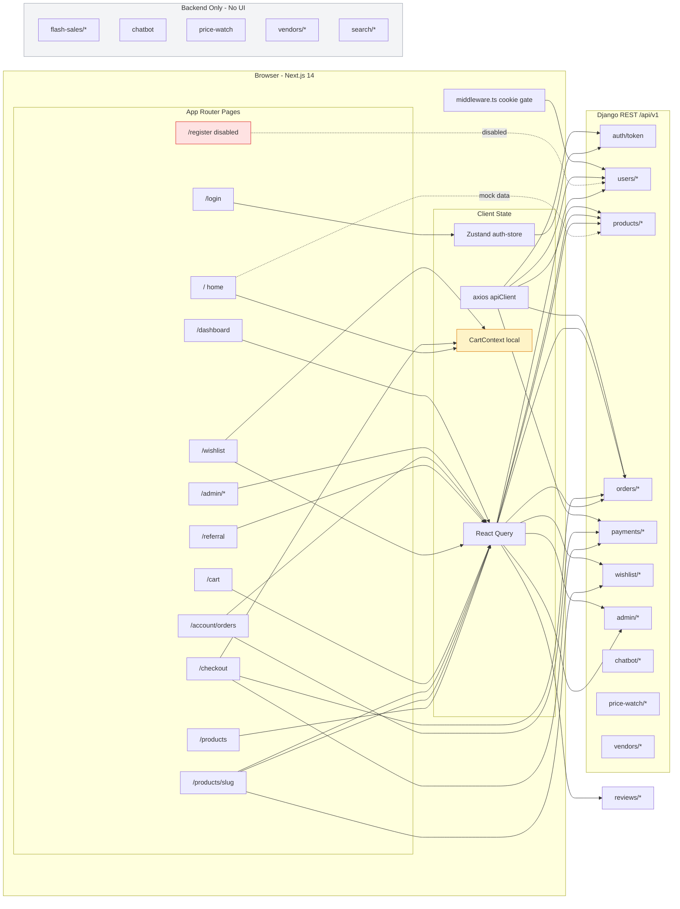

### Integration status matrix

| Frontend surface | Backend API | Sync quality |
|------------------|-------------|--------------|
| `/products`, `/products/[slug]` | `products/`, `reviews/` | ✅ Good |
| `/cart` | `orders/carts/`, `cart-items/` | ✅ Good |
| `/checkout` | `orders/create/`, `payments/*` | ⚠️ Uses **local** cart, not server |
| `/` home | — | ❌ Hardcoded products |
| `/wishlist` | `wishlist/` | ⚠️ Add-to-cart → local context |
| `/referral` | `users/referral-summary/` | ✅ Good |
| `/account/orders` | `orders/my-orders/` | ✅ Good |
| `/login` | `auth/token/` | ⚠️ No refresh interceptor |
| Chatbot, Price watch, Vendors, Flash sales | APIs exist | ❌ No pages |

---

# 3. API Flow Map

## 3.1 Global API topology

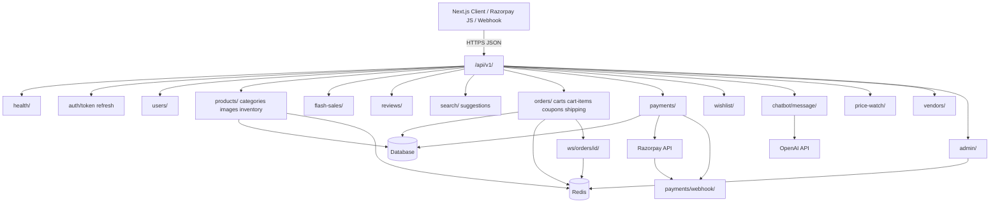

## 3.2 Checkout & payment sequence

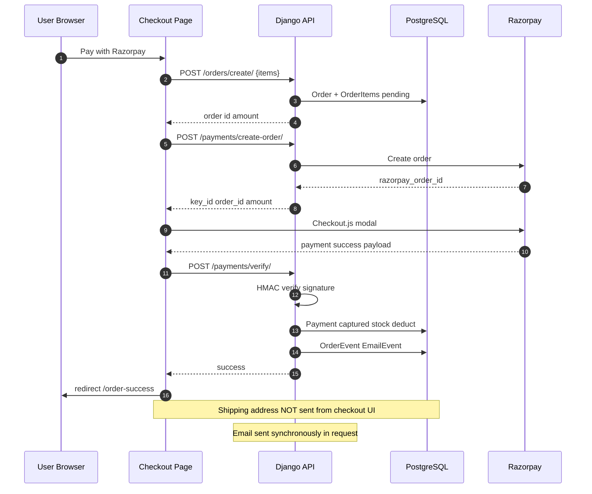

## 3.3 Admin order fulfillment sequence

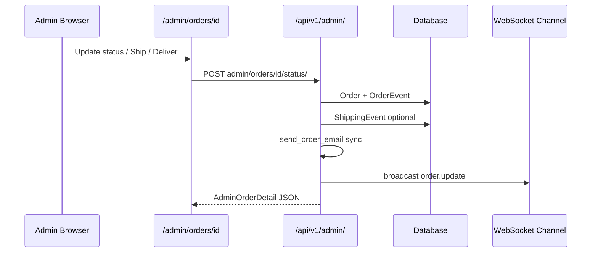

---

# 4. User Flow (Customer / Student)

```mermaid
flowchart TD
    START([Landing /]) --> CHOICE{Authenticated?}

    CHOICE -->|No| BROWSE_G[Browse mock products on /]
    BROWSE_G --> LOGIN_G[/login]
    LOGIN_G -->|JWT| AUTH_OK[Auth OK]

    CHOICE -->|Yes| AUTH_OK
    BROWSE_G --> PROD_LIST[/products API listing]
    LOGIN_G --> PROD_LIST

    PROD_LIST --> PDETAIL[Product detail + reviews + wishlist]
    PDETAIL --> ADD_LOCAL[Add to cart - local context]
    PDETAIL --> ADD_WISH[Add to wishlist API]

    ADD_LOCAL --> HOME_CART[Cart drawer on home]
    ADD_WISH --> WISH_PAGE[/wishlist]
    WISH_PAGE --> MOVE_CART[Move to cart - local]

    AUTH_OK --> CART_SERVER[/cart - server API]
    ADD_LOCAL --> CHK[/checkout - local cart]
    MOVE_CART --> CHK
    CART_SERVER -.->|different items| CHK

    CHK --> FILL[Name + email only wired]
    FILL --> CREATE[POST orders/create]
    CREATE --> RZP[Razorpay modal]
    RZP -->|success| VERIFY[POST payments/verify]
    RZP -->|fail| RETRY_UI[Error / retry on order page]
    VERIFY --> SUCCESS[/order-success]

    SUCCESS --> MY_ORDERS[/account/orders]
    MY_ORDERS --> DETAIL[Order detail cancel retry pay]
    DETAIL --> TRACK[/track - placeholder UI]

    AUTH_OK --> REF_PAGE[/referral share link]
    REF_PAGE -->|ref param| REG_BROKEN[/register DISABLED]

    style CHK fill:#fef3c7,stroke:#d97706
    style CART_SERVER fill:#fef3c7,stroke:#d97706
    style REG_BROKEN fill:#fee2e2,stroke:#dc2626
    style TRACK fill:#fee2e2,stroke:#dc2626
    style BROWSE_G fill:#fee2e2,stroke:#dc2626
```

### User flow gaps (annotated)

| Step | Expected | Actual |
|------|----------|--------|
| Discover products | API catalog on home | Mock data on `/` |
| Sign up | `/register` | UI disabled; API works |
| Cart | Single source of truth | Local vs server split |
| Checkout address | Saved to order | Fields not bound |
| Track shipment | Live timeline | Static placeholder |

---

# 5. Admin Flow

```mermaid
flowchart TD
    ASTART([Admin user is_staff]) --> MW{middleware cookie + GET /users/me/}

    MW -->|fail| DENY[Redirect / or /login]
    MW -->|ok| ADMIN_HOME

    subgraph admin_routes [Protected Routes]
        ADMIN_HOME[/admin placeholder metrics]
        DASH[/dashboard live analytics]
        ANALYTICS[/admin/analytics summary API]
        ORD_LIST[/admin/orders list]
        ORD_DET[/admin/orders/id detail]
    end

    DASH --> API1[GET /api/v1/admin/analytics/]
    ANALYTICS --> API2[GET /api/v1/admin/analytics/summary/]
    ORD_LIST --> API3[GET /api/v1/admin/orders/]
    ORD_DET --> API4[GET admin/orders/id/]

    ORD_DET --> ACT{Action}
    ACT --> STATUS[POST status/]
    ACT --> SHIP[POST ship/]
    ACT --> DELIVER[POST deliver/]

    STATUS --> DB[(Order OrderEvent Email)]
    SHIP --> DB
    DELIVER --> DB

    ADMIN_HOME -.->|no API wired| EMPTY[Shows -- placeholders]

    subgraph django_admin [Parallel Path - Django Admin]
        DJANGO[/admin/ Django UI]
        DJANGO --> CRUD[Full model CRUD products users coupons]
    end

    ASTART --> DJANGO

    style ADMIN_HOME fill:#fee2e2,stroke:#dc2626
    style DASH fill:#d1fae5,stroke:#059669
    style ANALYTICS fill:#d1fae5,stroke:#059669
```

### Admin capability split

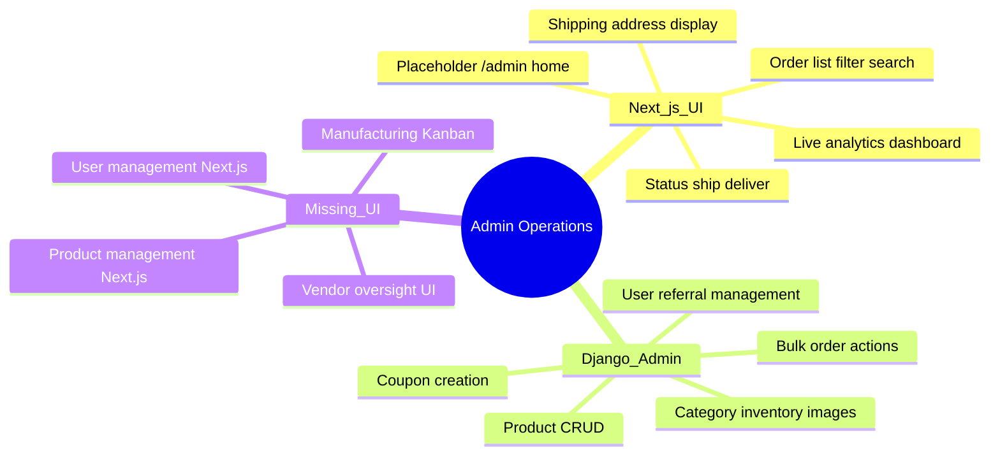

---

# 6. Database Relationship Map

```mermaid
erDiagram
    User ||--o{ Order : places
    User ||--o{ Cart : owns
    User ||--o{ CartItem : via_cart
    User ||--o{ Review : writes
    User ||--o{ Wishlist : saves
    User ||--o{ PriceWatch : watches
    User ||--o{ Referral : referrer
    User ||--o| Referral : referred_one
    User ||--o| Vendor : profile
    User ||--o{ Coupon : eligible_for

    Category ||--o{ Product : contains
    Product ||--o{ ProductImage : has
    Product ||--o| Inventory : tracks
    Product ||--o{ Review : receives
    Product ||--o{ FlashSale : promotes
    Product ||--o{ CartItem : in_cart
    Product ||--o{ OrderItem : in_order
    Product ||--o{ Wishlist : wishlisted
    Product ||--o{ PriceWatch : watched
    Product ||--o| VendorProduct : listed_by

    Cart ||--o{ CartItem : contains
    Cart }|--|| User : belongs_to

    Order ||--|{ OrderItem : contains
    Order ||--o| ShippingAddress : has
    Order ||--o{ ShippingEvent : tracks
    Order ||--o{ OrderEvent : audits
    Order ||--o{ EmailEvent : notifies
    Order ||--o{ Payment : paid_via
    Order ||--o| Coupon : applied
    Order ||--o| CouponUsage : records
    Order ||--o{ VendorOrder : splits

    Payment ||--o{ PaymentEvent : immutable_log
    PaymentWebhookEvent ||--|| Payment : dedupes

    Vendor ||--o{ VendorProduct : sells
    Vendor ||--o{ VendorOrder : earns

    Referral }|--|| User : referred_user
    Referral }|--|| User : referrer
```

### Planned entities (not in schema)

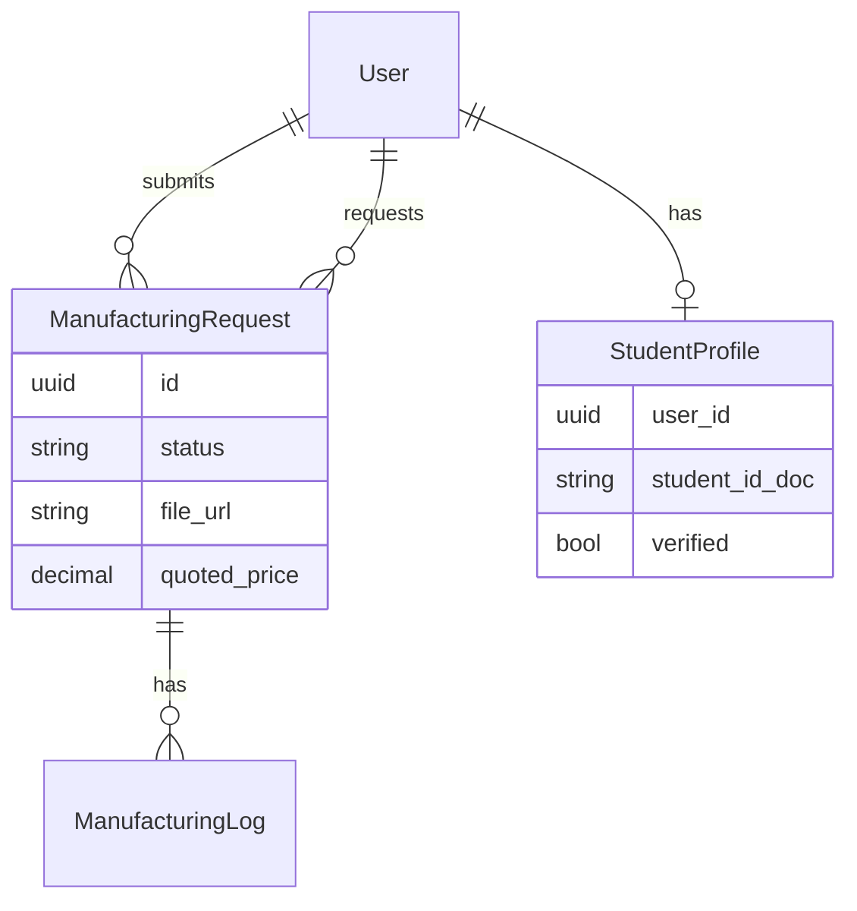

---

# 7. Missing Systems Map

What the **docs/PRD** describe vs what **runs in production code**.

```mermaid
flowchart LR
    subgraph built [Built Systems]
        B1[Ecommerce Core]
        B2[Razorpay Payments]
        B3[JWT Auth]
        B4[Admin Order Ops]
        B5[Wishlist Reviews Referral]
        B6[Vendor APIs]
        B7[Chatbot API]
        B8[Price Watch CMD]
        B9[Redis Cache + CI]
    end

    subgraph partial [Partial / Infra Only]
        P1[Celery worker health task only]
        P2[WebSocket backend no FE]
        P3[Server cart vs client cart]
        P4[Cloudinary URLs only no SDK]
    end

    subgraph missing [Missing Systems]
        M1[Manufacturing pipeline]
        M2[Cloudinary direct upload]
        M3[Vendor portal UI]
        M4[Chatbot UI]
        M5[Flash sale storefront]
        M6[Student verification]
        M7[S3 object storage]
        M8[E2E test suite]
        M9[Celery beat + email tasks]
        M10[Prometheus Sentry]
        M11[Stripe PayPal]
        M12[Legal pages routes]
    end

    built --> partial
    partial --> missing
```

### Missing systems detail

| System | PRD / docs | Code | Frontend | Ops |
|--------|------------|------|----------|-----|
| Manufacturing | ✅ Full state machine | ❌ | ❌ | ❌ |
| Cloudinary | ✅ | ❌ URL only | ❌ | ❌ |
| Unified cart | Implied | ⚠️ Dual | ⚠️ | — |
| Customer registration | ✅ | ✅ API | ❌ UI | — |
| Shipment tracking | ✅ | ✅ model | ❌ UI | — |
| Celery jobs | ✅ | ⚠️ stub | — | ⚠️ worker only |
| Recommendations API | Implied | ⚠️ service | ❌ | — |
| Multi-gateway payments | Optional | ❌ Razorpay only | ✅ | — |

---

# 8. Current vs Planned Architecture

## 8.1 Current architecture (as deployed in repo)

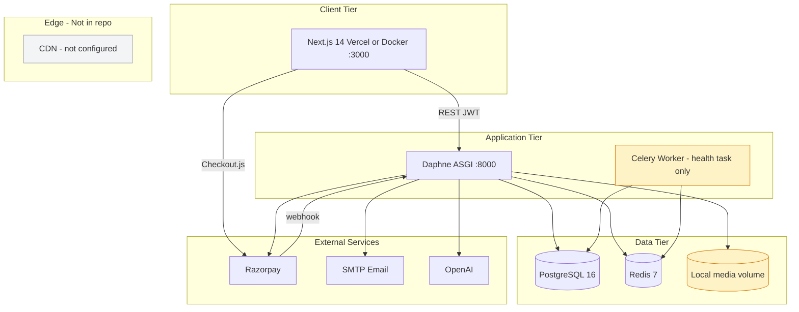

## 8.2 Planned architecture (from PRD / TRD / ROADMAP)

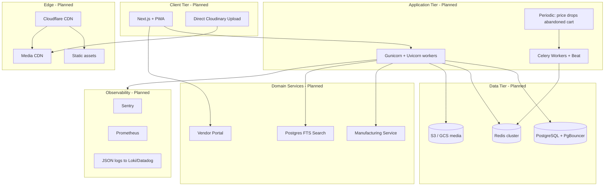

## 8.3 Gap diagram: current → planned

```mermaid
flowchart LR
    subgraph now [NOW]
        N1[Modular monolith Django]
        N2[Next storefront partial]
        N3[SQLite or Postgres]
        N4[Local media volume]
        N5[Sync emails]
        N6[Python search]
    end

    subgraph gap [GAP]
        G1[Unify cart + register UI]
        G2[Celery task migration]
        G3[S3 + CDN]
        G4[Manufacturing module]
        G5[Vendor + chatbot FE]
    end

    subgraph target [TARGET]
        T1[Production-grade monolith]
        T2[Full storefront]
        T3[Postgres + pooler]
        T4[Object storage]
        T5[Async notifications]
        T6[FTS or Elasticsearch]
        T7[Vertical manufacturing]
    end

    now --> gap --> target
```

---

# 9. Deployment & Runtime Map

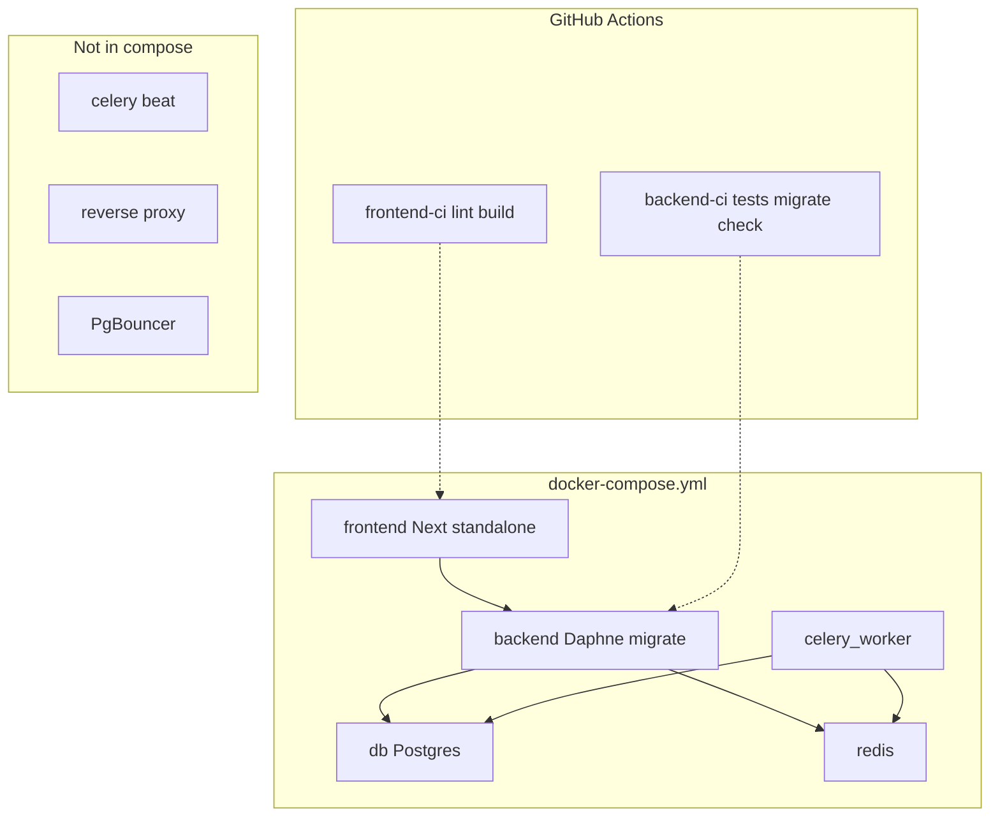

---

# 10. Priority wiring diagram (what to connect first)

Recommended order to collapse the **split-brain** architecture:

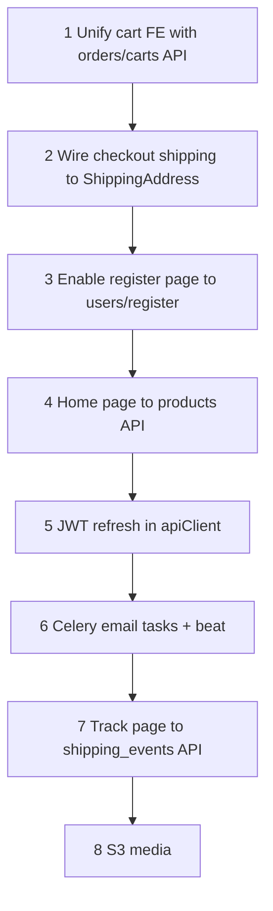

---

## Related files

| Document | Purpose |
|----------|---------|
| `PROJECT_RECOVERY_REPORT.md` | Narrative audit & completion % |
| `API_CONTRACT.md` | Endpoint reference |
| `docs/ROADMAP.md` | Phased engineering tasks |
| `docs/AUDIT_REPORT.md` | Security & architecture audit |

---

*End of Visual Development Map*
