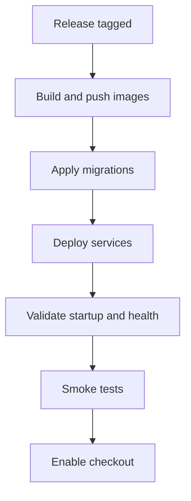

# Production Deployment Runbooks

## Purpose
- Provide safe, repeatable deployments with minimal risk.
- Minimize downtime and allow fast rollback.

## Preconditions
- CI is green for backend and frontend.
- Migrations reviewed and rollback plan documented.
- Feature flags default to safe values (checkout off if needed).
- Backups confirmed within last 24 hours.

## Staging deployment runbook
1. Build and tag images for the release.
2. Update staging env vars and secrets.
3. Apply database migrations.
4. Deploy services with `docker compose -f docker-compose.prod.yml up -d`.
5. Run `python manage.py validate_startup`.
6. Run smoke tests and monitor for 30 minutes.

## Production deployment runbook
1. Announce deployment window and freeze changes.
2. Enable checkout kill switch or payment pause flag.
3. Take a pre-deploy database snapshot.
4. Deploy new images for backend, frontend, worker, scheduler.
5. Run migrations (`python manage.py migrate`).
6. Restart workers and scheduler after migrations.
7. Verify health endpoints and key dashboards.
8. Gradually re-enable checkout and monitor.

## Rollback procedure
Code rollback:
- Redeploy last known good images.
- Keep DB if migrations are backward compatible.

Database rollback:
- Stop writes (checkout disabled, workers paused).
- Roll back migrations to previous version.
- If rollback is unsafe, restore from the pre-deploy snapshot.

## Migration rollback guidance
- Use expand and contract migrations for any schema change.
- Avoid dropping columns or tables in the same release.
- Data migrations must be idempotent and reversible when possible.
- If a migration is irreversible, require a maintenance window and fresh backup.

## Deployment health verification checklist
- `python manage.py validate_startup` passes.
- `/api/v1/health/` returns OK.
- Login and token refresh works.
- Create cart, start checkout, and verify stock validation.
- Complete a payment in staging and verify webhook handling.
- Celery worker and scheduler are processing tasks.
- Error rate and latency within baseline.
- No spike in failed payments or pending orders.

## Feature-flag readiness strategy
- Maintain flags for:
  - checkout_enabled
  - payments_enabled
  - webhooks_enabled
  - order_emails_enabled
- Default new features to off in production.
- Roll out in stages: internal, 10 percent, 50 percent, 100 percent.
- Keep a documented owner for each flag and a rollback plan.

## Deployment flow diagram

