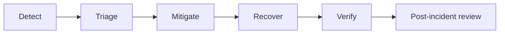

# Incident Response Playbooks

## Scope
This guide covers operational incidents for payments, webhooks, inventory, auth, Redis, and database degradation.

## Severity classification
| Severity | Definition | Response target |
| --- | --- | --- |
| Sev0 | Full outage, data loss, or payment capture with no order creation | Immediate |
| Sev1 | Major revenue impact or high error rates (>= 10 percent) | < 30 minutes |
| Sev2 | Partial degradation or localized issue | < 2 hours |
| Sev3 | Minor issue or low impact | Next business day |

## Escalation guidance
- Sev0: page on-call, notify engineering lead and operations.
- Sev1: page on-call, notify product owner.
- Sev2: assign incident owner and open tracking ticket.
- Sev3: log and schedule fix.

## Standard incident workflow
1. Detect and declare incident.
2. Triage scope and severity.
3. Mitigate user impact.
4. Recover systems and data.
5. Verify success.
6. Post-incident review and follow-ups.

### Playbook: Payment failures
Symptoms or triggers:
- Payment success rate drop or verification failures.
- Webhook retry queue growing.

Immediate actions:
- Pause new checkouts if error rate > 10 percent.
- Verify Razorpay status page and API health.
- Confirm webhook signature validation is working.

Diagnosis:
- Check `PaymentEvent` and `PaymentWebhookEvent` logs.
- Compare Razorpay dashboard payments vs local orders.
- Review backend errors for `VerifyRazorpayPaymentView`.

Recovery:
- Run payment reconciliation job.
- Mark affected orders as `payment_processing` or `failed` as needed.
- Re-enable checkout after error rate stabilizes.

Verification:
- Payment verification succeeds for test payment.
- Webhook queue backlog is draining.

Post-incident:
- Document root cause and add alert if missing.

### Playbook: Webhook outage
Symptoms or triggers:
- No webhook events received for > 10 minutes.
- Webhook retries exceed threshold.

Immediate actions:
- Switch to polling reconciliation job at higher frequency.
- Notify payment provider support if their status is degraded.

Diagnosis:
- Check webhook endpoint health and logs.
- Validate webhook secret and signature verification.

Recovery:
- Re-enable webhook delivery and run reconciliation.
- Replay missed events if provider supports it.

Verification:
- New webhook events are processed end to end.

Post-incident:
- Review webhook retry limits and alerting.

### Playbook: Inventory corruption
Symptoms or triggers:
- Negative stock, overselling, or mismatched reserved quantity.
- Reports of missing stock during checkout.

Immediate actions:
- Pause checkout and order creation.
- Disable reservation cleanup job to avoid compounding.

Diagnosis:
- Run inventory audit against recent orders and reservations.
- Identify products with inconsistent totals.

Recovery:
- Reconcile stock from last known good order state.
- Re-run reservation cleanup and restart checkout.

Verification:
- Inventory audit returns clean for all SKUs.

Post-incident:
- Add or tune inventory audit logging and alerts.

### Playbook: Auth outage
Symptoms or triggers:
- Spike in login failures or refresh token errors.
- JWT verification errors.

Immediate actions:
- Verify auth service logs and database connectivity.
- If secrets rotated recently, confirm current `SECRET_KEY` and JWT settings.

Diagnosis:
- Check Redis availability if sessions are stored there.
- Validate time drift on servers.

Recovery:
- Roll back auth config changes.
- Rotate keys only if compromise is confirmed.

Verification:
- Login and refresh succeed for test account.

Post-incident:
- Add alert for auth failure rate and token refresh errors.

### Playbook: Redis outage
Symptoms or triggers:
- Cache errors, Celery queue stalled, WebSocket disconnects.

Immediate actions:
- Disable non-critical cache usage (fail open).
- Pause Celery workers to prevent task loss.

Diagnosis:
- Check Redis process health, memory usage, and persistence state.

Recovery:
- Restart Redis and restore AOF/RDB if needed.
- Resume workers and verify task processing.

Verification:
- Queue depth returns to normal, cache errors stop.

Post-incident:
- Review persistence configuration and memory limits.

### Playbook: Database degradation
Symptoms or triggers:
- Elevated query latency or connection pool exhaustion.
- Timeouts on checkout or order creation.

Immediate actions:
- Pause checkout and heavy admin tasks.
- Identify hot queries and lock contention.

Diagnosis:
- Inspect slow query logs and DB metrics.
- Identify migrations or background jobs causing load.

Recovery:
- Add or adjust indexes.
- Scale DB resources or reduce worker concurrency.

Verification:
- Latency returns to baseline and error rate drops.

Post-incident:
- Capture query plan and add regression tests if needed.
