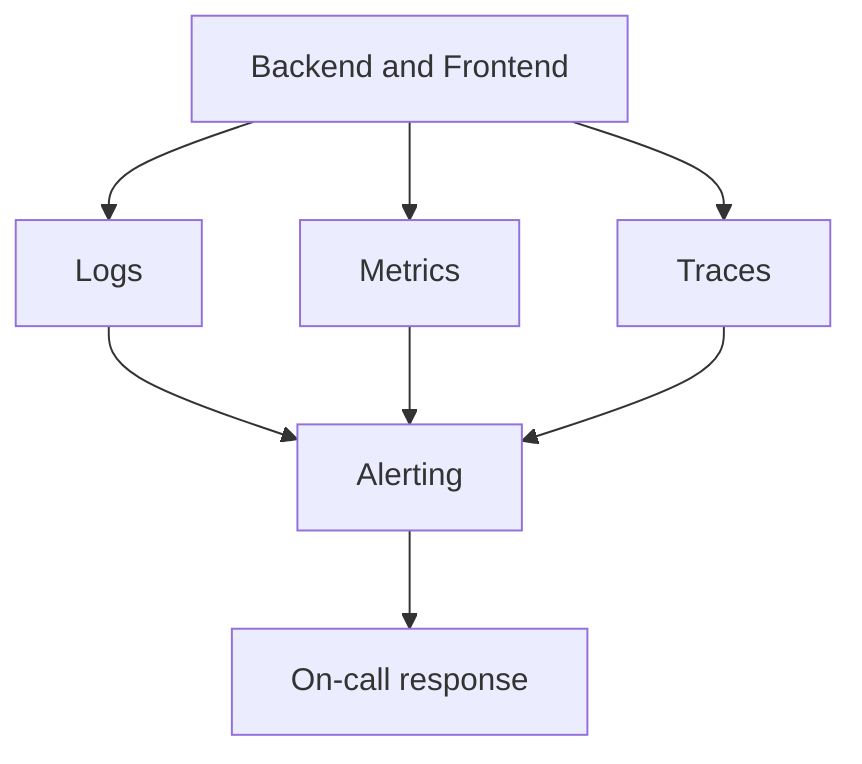

# Observability Operations Guide

## Goals
- Detect failures early.
- Provide actionable signals for payments and inventory.
- Measure release impact.

## Critical alerts (page on-call)
- API 5xx rate > 2 percent for 5 minutes.
- Checkout error rate > 3 percent for 5 minutes.
- Payment verification failures > 5 in 10 minutes.
- Webhook retry queue > 50 for 10 minutes.
- Reservation cleanup failures > 3 in 15 minutes.
- Redis connection errors > 5 percent for 5 minutes.
- DB connection saturation > 80 percent for 5 minutes.

## Sentry alert rules
Backend:
- New issue rate > 5 per 10 minutes.
- Error rate > 2 percent for 5 minutes.
- Payment verify errors grouped by endpoint.
Frontend:
- Checkout page errors > 1 percent.
- Payment callback errors > 5 per 10 minutes.

## Latency thresholds (tune to baseline)
| Endpoint or workflow | p95 target | p99 target |
| --- | --- | --- |
| Login and refresh | <= 500 ms | <= 1200 ms |
| Product browse | <= 600 ms | <= 1500 ms |
| Checkout start | <= 800 ms | <= 2000 ms |
| Payment verify | <= 1500 ms | <= 3000 ms |
| Webhook processing | <= 2000 ms | <= 5000 ms |

## Payment anomaly alerts
- Payment success rate drop > 5 percent vs 7 day baseline.
- Pending payments older than 15 minutes > 20.
- Retry payment attempts > 10 percent in 10 minutes.

## Auth anomaly alerts
- Login failure rate > 5 percent for 10 minutes.
- Refresh token failure rate > 3 percent for 10 minutes.
- Suspicious IP rate limit triggers spike > 2x baseline.

## Production dashboards guidance
Minimum dashboards:
- API health: request rate, 5xx, 4xx, p95 latency.
- Checkout and payments: start checkout, verify success, webhook lag.
- Orders and inventory: pending orders, reservation cleanup failures.
- Celery and Redis: queue depth, task failures, worker uptime.
- Database: connections, slow queries, lock wait time.

## Observability data flow

