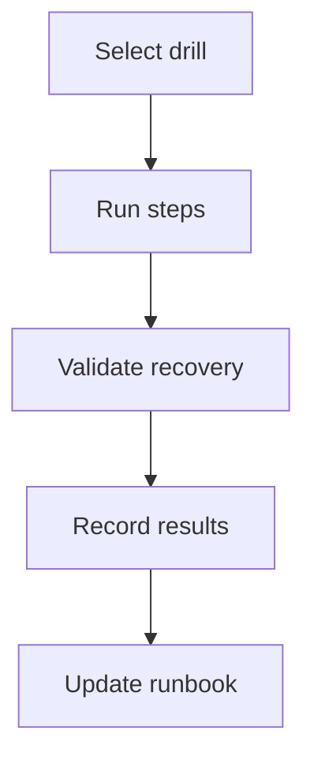

# Operational Simulation Guide

## Purpose
Run short, controlled drills to validate recovery and incident response before launch.

## 1) Backup restore drill
- Restore latest Postgres backup to staging.
- Run `python manage.py migrate` if required.
- Execute smoke tests and validate checkout + payment verification.
- Document restore time and issues.

## 2) Deployment rollback drill
- Deploy a known-bad build to staging (feature flag keeps checkout off).
- Trigger rollback using the runbook.
- Verify health endpoints and checkout flow.
- Record rollback time.

## 3) Incident simulation
Pick one scenario per drill:
- Payment verification failures
- Webhook outage
- Inventory corruption
- Auth outage

Steps:
1. Declare incident and set severity.
2. Apply mitigation (e.g. disable checkout).
3. Run diagnostics and capture evidence.
4. Execute recovery steps.
5. Confirm service is healthy.

## Success criteria
- Time to mitigation < 30 minutes.
- Recovery steps executed without guesswork.
- Post-incident notes captured in ops log.
