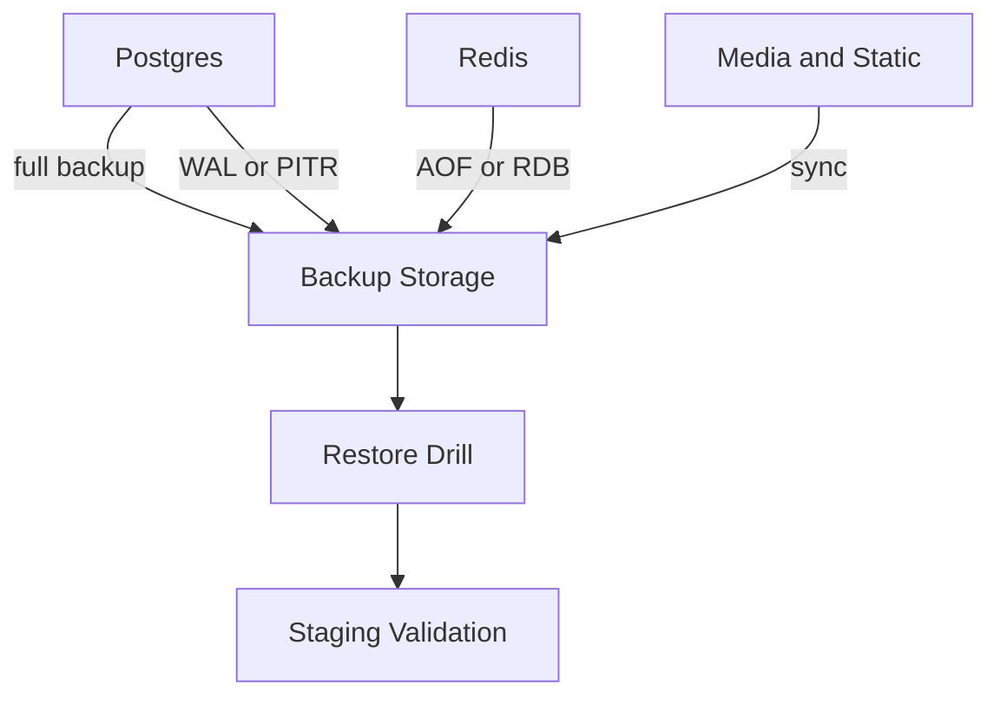

# Production Backup and Recovery Strategy

## Scope and goals
- Protect transactional data (orders, payments, inventory, users).
- Restore service safely with minimal downtime.
- Keep the process simple, repeatable, and testable.

## Target recovery objectives
RPO = maximum acceptable data loss. RTO = maximum acceptable downtime.

| Component | Target RPO | Target RTO | Notes |
| --- | --- | --- | --- |
| PostgreSQL | <= 15 min | <= 2 hours | Requires PITR or frequent WAL archive. |
| Redis | <= 1 hour | <= 1 hour | Use AOF or managed persistence. |
| Media/Static | <= 24 hours | <= 4 hours | Object storage or nightly sync. |

If PITR is not enabled, PostgreSQL RPO becomes the time between full backups.

## Backup strategy

### PostgreSQL
Managed Postgres (recommended):
- Enable automated daily backups and PITR.
- Retain 14 to 30 days of backups.
- Store in provider-managed storage with encryption at rest.

Self-managed Postgres:
- Nightly full backups with `pg_dump` (custom format).
- WAL archiving every 15 minutes or less for PITR.
- Retain 7 daily and 4 weekly backups.
- Store backups off-host (separate disk or object storage).
- Encrypt backups at rest and in transit.

### Redis
- If Redis is used for cache only, persistence is optional.
- If Redis is used for Celery broker or sessions, enable persistence:
  - AOF enabled with `appendfsync everysec`.
  - Daily RDB snapshots for quick restore.
- Treat Redis as recoverable, not authoritative. Critical state should still live in Postgres.

### Media and static assets
- Prefer object storage (S3, Cloudinary) with versioning enabled.
- If using local storage, run nightly `rsync` to object storage or a backup disk.
- Retain 30 days of media backups.

### Configuration and secrets
- Store env files and deployment configs in a private secret manager.
- Back up infrastructure config (compose files, CI configs) in the repo.

## Backup schedule and retention
- Postgres full backup: daily at low traffic.
- Postgres PITR/WAL: continuous or every 15 minutes.
- Redis AOF: continuous; RDB: daily.
- Media: nightly sync.
- Retention: 7 daily, 4 weekly, 3 monthly (minimum).

## Restore procedures

### PostgreSQL (managed)
1. Provision a new database instance.
2. Restore to a point-in-time before the incident.
3. Update `DATABASE_URL` and restart backend services.
4. Run `python manage.py migrate` if needed.
5. Verify core workflows (login, browse, checkout, payment verify).

### PostgreSQL (self-managed)
1. Stop backend services and workers.
2. Restore database from latest backup.
3. Apply WAL for PITR if available.
4. Start services, run health checks, verify flows.

### Redis
1. Stop Redis.
2. Restore AOF/RDB files.
3. Restart Redis and workers.
4. Monitor queue processing and cache behavior.

### Media and static
1. Restore media from backup storage.
2. Validate a sample of product images and uploads.
3. Clear CDN cache if needed.

### Application verification after restore
- `python manage.py validate_startup`
- `/api/v1/health/` returns OK
- Run payment reconciliation job
- Run reservation cleanup job
- Validate last 10 orders and payments

## Backup verification guidance
- Weekly restore drill to staging.
- Verify schema, row counts, and critical queries.
- Compare order/payment counts with production.
- Record restore time and issues in an ops log.

## Disaster recovery checklist
- Declare incident and open a response channel.
- Pause checkout (feature flag) and stop background workers.
- Identify last good backup and target restore time.
- Restore Postgres, then Redis, then media.
- Run app verification checklist.
- Re-enable workers and checkout.
- Document timeline, root cause, and remediation actions.

## Backup architecture diagram

