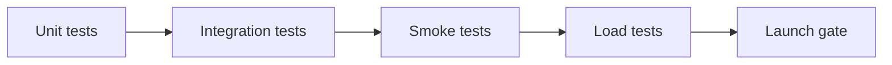

# Testing Strategy

## Goals
- Validate checkout, reservations, payments, and auth under production-like behavior.
- Detect hidden reliability issues before launch.
- Keep tests repeatable and fast enough for CI and staging gates.

## Test layers
1. Unit and model tests (fast, deterministic).
2. Integration tests (API flows and state transitions).
3. Smoke tests (staging and prod pre/post deploy).
4. Load tests (k6 and Locust scenarios).



## Integration coverage map
- Checkout lifecycle: `OrderViewSet.checkout_from_cart` + reservations + payment creation.
- Payment verification: signature validation, finalization, idempotency.
- Reservation expiration: `expire_stale_reservations`, cleanup task.
- Auth refresh flow: `/api/v1/auth/token/refresh/` success and failure.
- Webhook replay safety: duplicate event idempotency and stock safety.
- Rollback recovery: reservation cleanup task and release paths.

## Where to run
- Local: `python manage.py test`
- Staging gate: run full suite + smoke test script.
- Pre-launch: run load tests with staged data.

## Smoke test automation
Script: `scripts/smoke_test.py`

Required environment variables:
- `SMOKE_BASE_URL` (default: `http://localhost:8000/api/v1`)
- `SMOKE_EMAIL`
- `SMOKE_PASSWORD`
- `SMOKE_TIMEOUT` (seconds)

Example:
```
SMOKE_BASE_URL=https://api-staging.example.com/api/v1 \
SMOKE_EMAIL=smoke@example.com \
SMOKE_PASSWORD=StrongPass123 \
python scripts/smoke_test.py
```

## Load testing
Scripts in `load_tests/` cover:
- concurrent checkout
- inventory contention
- webhook bursts
- auth refresh storms

Use `docs/LOAD_TEST_GUIDANCE.md` for targets and environment variables.

## CI and release gates
- All integration tests pass.
- Smoke test passes in staging.
- Load test report reviewed with no critical regressions.
- Observability dashboards showing expected metrics.
